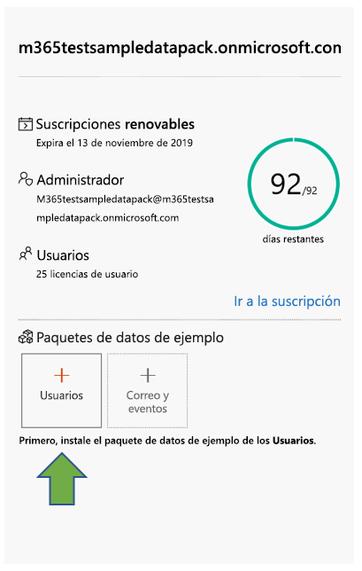
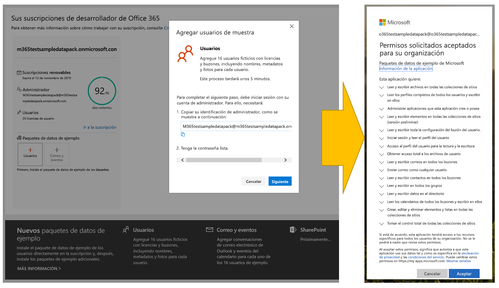
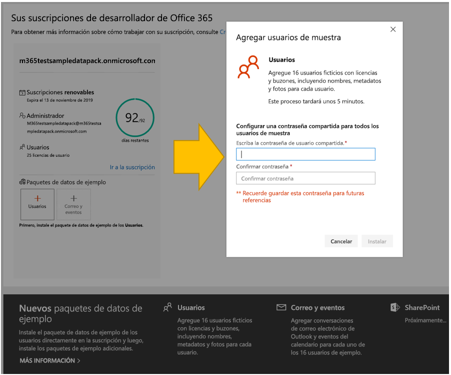
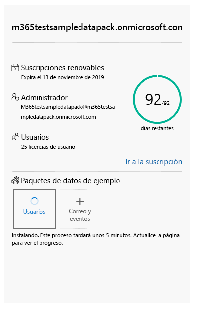
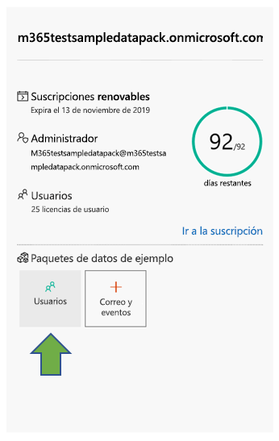
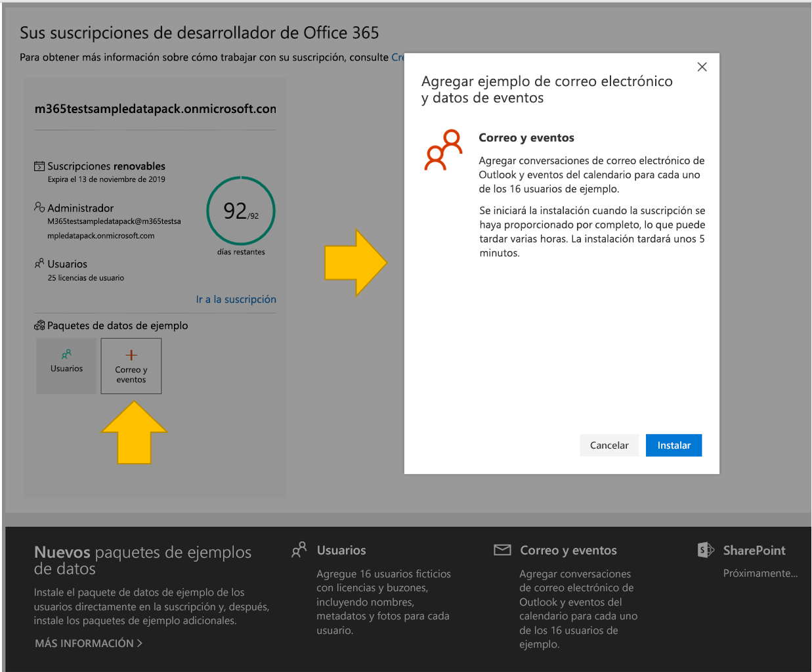
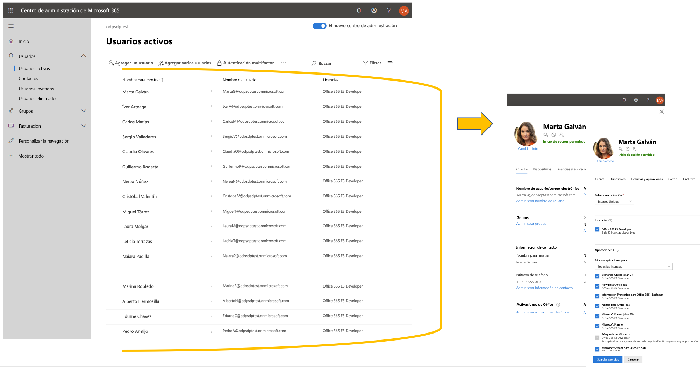
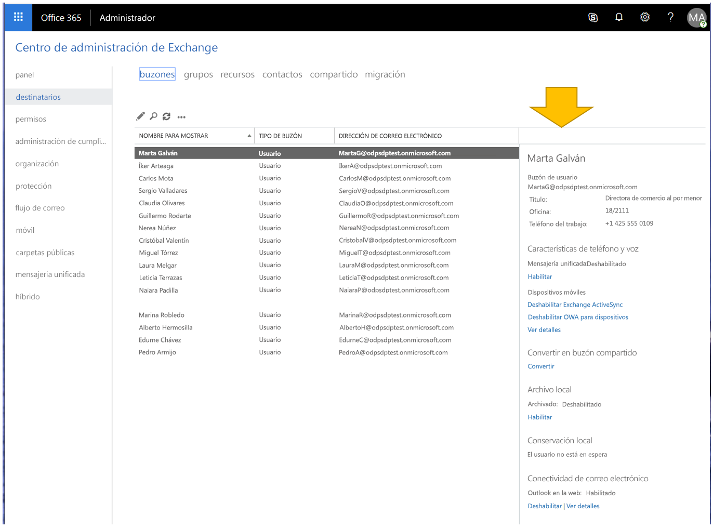

# Usar paquetes de datos de ejemplo con la suscripción al programa de desarrolladores de Microsoft 365

Puede instalar paquetes de datos de ejemplo en la suscripción al programa de desarrolladores de Microsoft 365. Los paquetes de datos de ejemplo le ahorran tiempo al instalar automáticamente los datos y contenidos necesarios para crear y probar sus soluciones. Esto incluye usuarios, metadatos y fotografías ficticios para simular un pequeño entorno corporativo. Puede instalar rápidamente los datos de ejemplo para poder concentrarse en sus soluciones en lugar de dedicar tiempo a crear los datos de ejemplo por su cuenta.

Puede encontrar paquetes de datos de ejemplo en el [panel del programa de desarrolladores de Microsoft 365](https://developer.microsoft.com/office/profile), en la parte inferior del icono de la suscripción.

Los siguientes paquetes de datos de ejemplo están disponibles actualmente:

- Usuarios: Instala 16 usuarios ficticios con licencias, buzones y metadatos, incluyendo nombres y fotos para cada usuario. Use las API de Microsoft Graph para trabajar con los datos de ejemplo de usuario de las siguientes maneras:
  - Obtener detalles del usuario específicos
  - Actualizar usuario
  - Obtener informes directos
  - Preparar un organigrama  
  - Obtener usuarios por departamento

- Correo y eventos: Agrega conversaciones de correo electrónico de Outlook y eventos del calendario para cada uno de los 16 usuarios de ejemplo. Use las API de Microsoft Graph para trabajar con los datos de ejemplo de correo y eventos de las siguientes maneras:
  - Recibir mensajes de correo electrónico de los usuarios
  - Recibir mensajes de correo electrónico filtrados por fecha
  - Ver los próximos eventos
  - Actualizar o eliminar los próximos eventos

> [!NOTE]
> Debe instalar el paquete de datos de ejemplo de Usuarios antes de instalar Correo y Eventos.

## ¿Qué le agregan a la suscripción los paquetes de datos de ejemplo?

El paquete de datos de ejemplo de Usuarios crea 16 usuarios ficticios en su suscripción e incluye las licencias para cada usuario, los buzones de correo, los nombres, los metadatos y las fotos para cada uno.

El paquete de datos de ejemplo de Correo y Eventos agrega conversaciones de correo electrónico de Outlook y eventos del calendario para cada uno de los 16 usuarios de ejemplo.

## ¿Cómo instalo el paquete de datos de ejemplo de Usuarios?

Antes de instalar el paquete de datos de ejemplo de usuarios, asegúrese de tener una suscripción de desarrollador de Microsoft 365 y de asignarse a sí mismo una licencia de administrador.

> [!NOTE]
> Asegúrese de que tiene 16 usuarios disponibles en la suscripción. La suscripción incluye 25 usuarios. Si ya ha configurado más de 10 usuarios, primero quite algunos de ellos para asegurarse de que la instalación se ha realizado correctamente.

Para instalar el paquete de datos de ejemplo de Usuarios:

1. Seleccione el cuadro **Usuarios** en la parte inferior del icono de suscripción.
2. Copie su Id. de administrador; lo necesitará para iniciar sesión en su suscripción.
3. Escriba su Id. de administrador y su contraseña en la página de inicio de sesión.
4. Conceda el consentimiento para los permisos de administrador de la suscripción de desarrollador de Microsoft 365.

5. Configure las contraseñas para todos los usuarios de ejemplo. Tendrá que tener una contraseña compartida definida para administrar fácilmente todos los usuarios ficticios.

6. Se instalarán los datos. La instalación debería tardar unos 5 minutos.

7. Cuando finalice la instalación, recibirá una notificación por correo electrónico y el cuadro del icono de la suscripción estará en verde. Ahora puede instalar el paquete de datos de ejemplo de Correo y Eventos.

## ¿Cómo instalar el paquete de datos de ejemplo de Correo y Eventos?

Una vez que haya instalado el paquete de datos de ejemplo de Usuarios, puede proceder a instalar correo y eventos.

1. Elija el cuadro **Correo &amp; Eventos** en el icono de la suscripción.
2. Seleccione **Instalar** para comenzar la instalación.

> [!NOTE]
> Si acaba de crear su suscripción, la misma debe estar completamente aprovisionada antes de poder iniciar la instalación. Esto puede tardar algunas horas. Una vez iniciada la instalación, puede tardar hasta 20 minutos en finalizar.

3. Cuando finalice la instalación, recibirá una notificación por correo electrónico y el cuadro del icono de la suscripción estará en verde.

## ¿Cómo se instala el paquete de datos de ejemplo de SharePoint?

El paquete de datos de muestra de SharePoint incluye siete plantillas diferentes de sitios de SharePoint entre las que puede elegir para probar y modelar soluciones de SharePoint para la colaboración, la comunicación, la participación y la administración del conocimiento.

Estas son algunas de las plantillas más populares del[ libro de apariencias de SharePoint PnP](https://provisioning.sharepointpnp.com/). Hoy en día, es sencillo crear soluciones de muestra de sitios y páginas atractivas y rápidas con un aspecto excelente en cualquier dispositivo o pantalla. Inspírese con estos diseños o agréguelos a su espacio aislado para empezar a crear su siguiente sitio.

Las plantillas se pueden instalar en su suscripción. Después de instalar una plantilla, tiene la opción de instalar las otras. En el proceso de instalación se incluyen los pasos siguientes:

1. Seleccione la plantilla que quiera en el menú desplegable.

  

2. Configure opciones personalizadas para sus sitios o acepte los valores predeterminados.
3. Use el id. de administrador de su espacio aislado y la contraseña para autenticar y conceder permisos de instalación. 

La instalación se realizará automáticamente.

>**Nota:** el aprovisionamiento de estas plantillas de sitio solo funciona con las suscripciones de Office 365 E3 o Microsoft 365 E5 para desarrolladores en inglés, y todo el contenido incluido está disponible solo en inglés.

## ¿Qué plantillas de SharePoint están disponibles?

El paquete de muestra de SharePoint incluye siete plantillas diferentes.

### Sitio de equipo con datos

La plantilla de equipo con datos incluye múltiples listas y bibliotecas de documentos que se asocian automáticamente con un sitio de equipo de SharePoint para ayudarle a desarrollar soluciones utilizando SharePoint Framework, Power Apps y Microsoft Graph.

Esta plantilla contiene los datos siguientes:

- Una lista de contactos con contactos previamente rellenados
- Una lista rellenada con más de 6 000 elementos
- Bibliotecas de documentos con ejemplos de documentos de PowerPoint, Excel, Word y OneNote
- Una lista de eventos con elementos de anuncios

Esta plantilla está integrada en los datos de ejemplo de los usuarios.

### Trabajar en Contoso
La plantilla Trabajar en Contoso consiste en múltiples colecciones de sitios que se asocian automáticamente al sitio central para mostrar cómo funcionarán todas las capacidades de agregación predeterminadas.

Esta plantilla contiene las siguientes estructuras y activos:

- Conjunto de colección de sitios principal como sitio central
- Dos sitios de comunicación asociados al sitio central: ventajas y sitios benéficos
- Un sitio de grupo de grupos asociado al sitio central: sitio de grupo
- Artículos de noticias de muestra en colecciones de subsitios
- Archivos de muestra de Word, Excel y PowerPoint
- Contenido de imagen de muestra usado en las colecciones de sitios

Las colecciones de subsitios usan las mismas plantillas, que también puede aprovisionar de forma independiente desde este servicio.

>**Nota:** si esta plantilla se aplica sobre un sitio de comunicación existente, el contenido de la página de bienvenida del sitio se sobrescribirá.

### Conexión de liderazgo: noticias de liderazgo, eventos, compromiso

Este sitio de liderazgo ofrece información sobre las metas y prioridades del equipo directivo y anima a participar en eventos y conversaciones.

Al agregar este diseño al espacio empresarial, se creará el siguiente contenido:

- Ejemplo de página de bienvenida con demostración de elementos web
- Ejemplos de artículos de noticias en los que se muestran diferentes diseños de páginas modernas

Esta plantilla está integrada en los datos de ejemplo de los usuarios.

### El aterrizaje: noticias, recursos, contenido personalizado

Este sitio de comunicación está diseñado para ser el lugar en el que los empleados puedan encontrar las noticias y los recursos que necesitan, además de contenido personalizado diseñado solo para ellos.

Al agregar este diseño al espacio empresarial, se creará el siguiente contenido:

- Estructura de demostración del sitio de inicio del portal
- Estructura de la página de bienvenida personalizada
- Seis ejemplos adicionales de páginas modernas y artículos de noticias
- Imágenes de muestra y documentos de Office

### Perspectiva: noticias, vídeo, contenido personalizado

Diseñado para ofrecer noticias y contenido personalizado, este sitio también incluye vídeos para motivar la participación.
Al agregar este diseño al espacio empresarial, se creará el siguiente contenido:

- Diseños personalizados de la página de bienvenida
- Plantilla de página de muestra para artículos de noticias
- 12 artículos de noticias de muestra

### Nuevo centro de incorporación de empleados: conectarse, participar, informar

Simplifique y mejore el proceso de incorporación de nuevos empleados con plantillas predefinidas que abarquen los diferentes escenarios de las fases de incorporación: previo, a nivel de empresa y a nivel departamental. Esta solución digital ofrece cuatro plantillas de sitio distintas con contenido rellenado previamente que se puede personalizar según los objetivos de la organización.

Al agregar este diseño al espacio empresarial, se creará el siguiente contenido:

- Sitio previo a la incorporación, sitio de incorporación corporativa y dos sitios de incorporación departamentales
- Páginas de inicio personalizadas y previamente rellenadas para cada sitio
- Sitio central configurado para la incorporación corporativa y sitios asociados para la incorporación departamental
- Lista de comprobación de nuevos empleados en listas de SharePoint para ayudar a los nuevos empleados a incorporarse con éxito
- Contenido de ejemplo para el elemento web Contactos, el elemento web Yammer, el elemento web Noticias y el elemento web Vínculos rápidos
- Preguntas más frecuentes previamente escritas para cada sitio
- Recomendaciones para crear experiencias sociales y atractivas, como incluir un vídeo de bienvenida utilizando el elemento web de YouTube en el sitio previo a la incorporación.

### Comunicaciones de crisis: anuncios, noticias, recursos, comunidades y llamadas a la acción

Mantenga a la gente informada, comprometida y al tanto durante las crisis, desde eventos meteorológicos graves hasta emergencias sanitarias y de seguridad. Esta plantilla crea un recurso central para que los coordinadores y los comunicadores compartan noticias y anuncios importantes, una única fuente de verdad para que los usuarios puedan estar al día y un lugar para conectar a los usuarios de la organización.

Al agregar este diseño al espacio empresarial, se creará el siguiente contenido:

- Página de bienvenida personalizada creada con un elemento web
- Cuatro artículos de noticias con contenido de ejemplo

Esta plantilla está integrada en los datos de ejemplo de los usuarios.

## ¿Habrá más paquetes de datos de ejemplo?

Sí. En el futuro, consideraremos agregar paquetes de datos de ejemplo para más productos y tecnologías, como Microsoft Teams. Si tiene sugerencias de paquetes de datos de ejemplo que le gustaría ver, [cuéntenoslo](https://officespdev.uservoice.com/forums/224641-feature-requests-and-feedback?category_id=171306).

## ¿Puedo instalar paquetes de datos de ejemplo en mis otras suscripciones de Microsoft 365?

No. Estos paquetes de datos de ejemplo solo son compatibles con la suscripción de desarrollador de Microsoft 365 que recibe como parte del programa de desarrolladores de Microsoft 365.

## ¿Cómo puedo ver los datos de ejemplo en mi suscripción?

Después de instalar el paquete de datos de ejemplo de usuarios, para ver los usuarios que se han añadido, vaya al [**Centro de administración de Microsoft 365**](https://admin.microsoft.com/) en la suscripción de desarrollador de Microsoft 365. En **Usuarios**, seleccione **Usuarios activos**. Verá una lista de 16 usuarios. Puede seleccionar un usuario para ver los metadatos asociados, incluidas las fotos y las licencias.

Después de instalar el paquete de ejemplos de correo y eventos, para ver los datos de ejemplo, elija **Mostrar todo** y, después, seleccione **Exchange** en el [**Centro de administración de Microsoft 365**](/microsoft-365/admin/admin-overview/about-the-admin-center?view=o365-worldwide). En el Centro de administración de Exchange, al seleccionar **destinatarios**, puede ver que cada uno de los 16 usuarios tienen buzones de correo con correo y eventos añadidos.

## Vea también

- [Configurar una suscripción de desarrollador de Microsoft 365](microsoft-365-developer-program-get-started.md)
