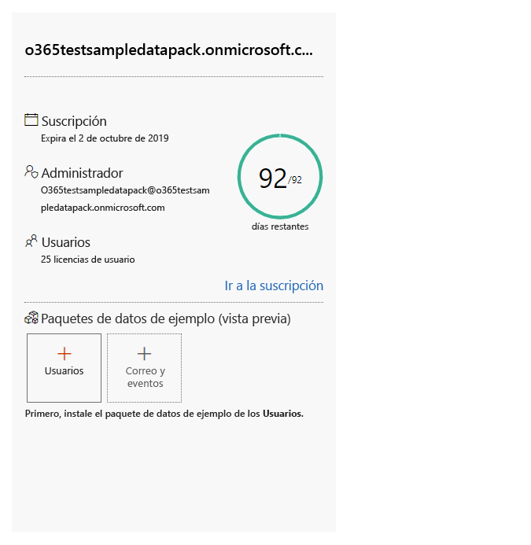
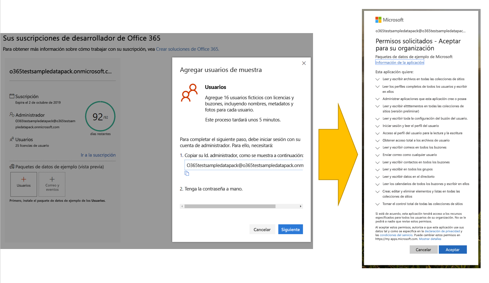
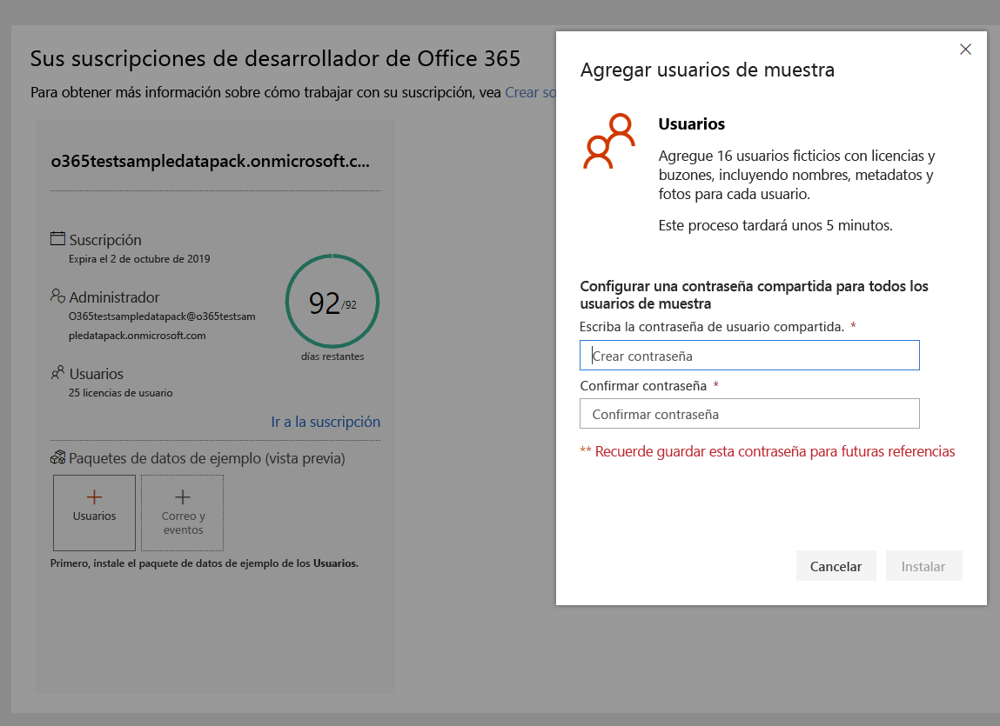
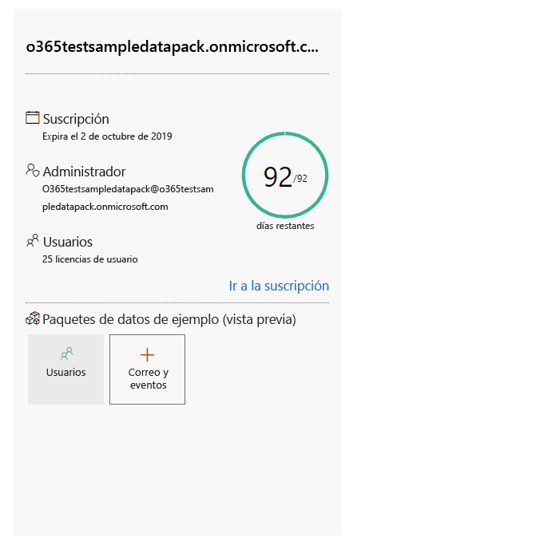
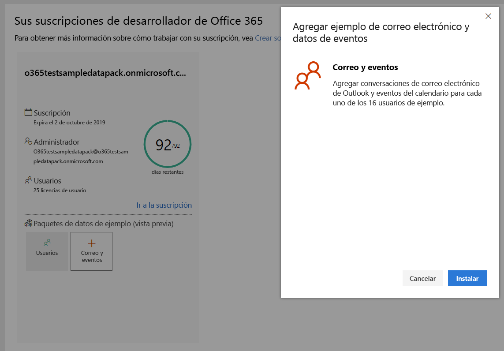

# Usar paquetes de datos de ejemplo con su suscripción de desarrollador de Office 365

Puede instalar paquetes de datos de ejemplo con su suscripción de desarrollador de Office 365 Los paquetes de datos de ejemplo le ahorran tiempo al instalar automáticamente los datos y contenidos necesarios para crear y probar sus soluciones. Esto incluye usuarios, metadatos y fotografías ficticios para simular un pequeño entorno corporativo. Puede instalar rápidamente los datos de ejemplo para poder concentrarse en sus soluciones en lugar de dedicar tiempo a crear los datos de ejemplo por su cuenta.

Puede encontrar paquetes de datos de ejemplo en el [Panel del programa para desarrolladores de Office 365](https://developer.microsoft.com/office/profile), en la parte inferior del icono de la suscripción a Office 365.

Los siguientes paquetes de datos de ejemplo están disponibles actualmente:

- Usuarios: Instala 16 usuarios ficticios con licencias, buzones y metadatos, incluyendo nombres y fotos para cada usuario. Use las API de Microsoft Graph para trabajar con los datos de ejemplo de usuario de las siguientes maneras:
  - Obtener detalles del usuario específicos
  - Actualizar usuario
  - Obtener informes directos
  - Preparar un organigrama  
  - Obtener usuarios por departamento

- Correo y eventos: Agrega conversaciones de correo electrónico de Outlook y eventos del calendario para cada uno de los 16 usuarios de ejemplo. Use las API de Microsoft Graph para trabajar con los datos de ejemplo de correo y eventos de las siguientes maneras:
  - Recibir mensajes de correo electrónico de los usuarios
  - Recibir mensajes de correo electrónico filtrados por fecha
  - Ver los próximos eventos
  - Actualizar o eliminar los próximos eventos

> [!NOTE]
> Debe instalar el paquete de datos de ejemplo de Usuarios antes de instalar Correo y Eventos.

## ¿Qué le agregan los paquetes de datos de ejemplo a mi suscripción de Office 365?

El paquete de datos de ejemplo de Usuarios crea 16 usuarios ficticios en su suscripción e incluye las licencias para cada usuario, los buzones de correo, los nombres, los metadatos y las fotos para cada uno.

El paquete de datos de ejemplo de Correo y Eventos agrega conversaciones de correo electrónico de Outlook y eventos del calendario para cada uno de los 16 usuarios de ejemplo.

## ¿Cómo instalo el paquete de datos de ejemplo de Usuarios?

Antes de instalar el paquete de datos de ejemplo de Usuarios, asegúrese de tener una suscripción de desarrollador de Office 365 y de asignarse a sí mismo una licencia de administrador.

Para instalar el paquete de datos de ejemplo de Usuarios:

1. Seleccione el cuadro **Usuarios** en la parte inferior del icono de suscripción.
2. Copie su Id. de administrador; lo necesitará para iniciar sesión en su suscripción.
3. Escriba su Id. de administrador y su contraseña en la página de inicio de sesión.
4. Conceda el consentimiento para los permisos de administrador de la suscripción de desarrollador de Office 365.

5. Configure las contraseñas para todos los usuarios de ejemplo. Tendrá que tener una contraseña compartida definida para administrar fácilmente todos los usuarios ficticios.

6. Se instalarán los datos. La instalación debería tardar unos 5 minutos.

7. Cuando finalice la instalación, recibirá una notificación por correo electrónico y el cuadro del icono de la suscripción estará en verde. Ahora puede instalar el paquete de datos de ejemplo de Correo y Eventos.

## ¿Cómo instalar el paquete de datos de ejemplo de Correo y Eventos?

Una vez que haya instalado el paquete de datos de ejemplo de Usuarios, puede proceder a instalar correo y eventos.

1. Elija el cuadro **Correo &amp; Eventos** en el icono de la suscripción.
2. Seleccione **Instalar** para comenzar la instalación.

> [!NOTE]
> Si acaba de crear su suscripción, la misma debe estar completamente aprovisionada antes de poder iniciar la instalación. Esto puede tardar algunas horas. Una vez iniciada la instalación, puede tardar hasta 20 minutos en finalizar.

3. Cuando finalice la instalación, recibirá una notificación por correo electrónico y el cuadro del icono de la suscripción estará en verde.

## ¿Habrá más paquetes de datos de ejemplo?

Sí. Agregaremos paquetes de datos de ejemplo para SharePoint y OneDrive. En el futuro, consideraremos agregar paquetes de datos de ejemplo para más productos y tecnologías, tales como los complementos de Office, Microsoft Teams, entre otros.

## ¿Puedo instalar paquetes de datos de ejemplo en mis otras suscripciones de Office 365?

No. Estos paquetes de datos de ejemplo solo son compatibles con las suscripciones de desarrollador de Office 365 que recibe como parte del programa para desarrolladores de Office 365.

## Vea también

- [Configurar una suscripción del programa de desarrolladores de Office 365](office-365-developer-program-get-started.md)
