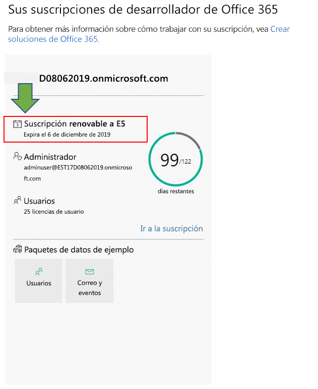
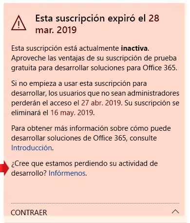

# Programa de desarrolladores de Microsoft 365

Estos son las preguntas más frecuentes sobre el programa de desarrolladores de Microsoft 365.

## ¿Qué es el programa de desarrolladores de Microsoft 365 y quién debería unirse?

El programa de desarrolladores de Microsoft 365 está diseñado para ayudarle a crear experiencias de productividad multiplataforma centradas en las personas que amplían Microsoft 365. Únase al programa para obtener acceso a herramientas, documentación, formación, expertos y eventos de la comunidad que necesita para crear soluciones excelentes para productos y tecnologías de Microsoft 365, incluidas las siguientes:

- los complementos web de [Excel](https://developer.microsoft.com/excel), [Outlook](https://developer.microsoft.com/outlook), [Word](https://developer.microsoft.com/word) y [PowerPoint](https://developer.microsoft.com/powerpoint)
- [SharePoint](https://developer.microsoft.com/sharepoint)
- [Microsoft Teams](https://developer.microsoft.com/microsoft-teams)
- [Microsoft Graph](https://developer.microsoft.com/graph)

Como miembro del programa, puede obtener una suscripción de desarrollador de Microsoft 365 gratuita con 25 licencias de usuario para crear sus soluciones. Esta suscripción permanecerá activa mientras siga desarrollando e implementando soluciones de manera activa.

Para obtener más información, vea [Unirse al programa de desarrolladores de Microsoft 365](microsoft-365-developer-program.md) y [Crear soluciones de Microsoft 365](build-microsoft-365-solutions.md).

## ¿Qué cuenta puedo usar para registrarme en el programa de desarrolladores de Microsoft 365?

Puede registrarse en el programa de desarrolladores con uno de los siguientes tipos de cuenta:

- **Cuenta de Microsoft** (creada personalmente para uso personal): da acceso a todos los servicios en la nube y productos orientados al consumidor de Microsoft, como Outlook (Hotmail), Messenger, OneDrive, MSN, Xbox Live o Microsoft 365. Al registrarse en un buzón de Outlook.com se crea automáticamente una cuenta de Microsoft. Después de crear una cuenta de Microsoft, puede usarla para obtener acceso a los servicios en la nube de Microsoft relacionados con el consumidor o Azure. 
- **Cuenta profesional** (emitida por un administrador para uso empresarial): da acceso a todos los servicios en la nube pequeños, medianos o de nivel empresarial de Microsoft, como Microsoft 365, Microsoft Intune o Azure. Cuando inicia sesión como una organización en uno de estos servicios, un directorio en la nube se aprovisiona automáticamente en Azure Active Directory para representar a su organización. Para obtener más información, vea [Administrar el directorio de Azure AD](https://docs.microsoft.com/azure/active-directory/active-directory-administer).
- **Identificador Visual Studio** (creado para las suscripciones de Visual Studio Professional o Enterprise): le recomendamos que use esta opción para unirse al programa de desarrolladores desde la Galería de Visual Studio para aprovechar todas las ventajas que tienen los suscriptores a Visual Studio. 

## ¿Cómo puedo obtener una suscripción de desarrollador de Microsoft 365 a través del programa de desarrolladores?  

Cuando se une al programa de desarrolladores de Microsoft 365, tendrá acceso a la suscripción gratuita de desarrollador de Microsoft 365 E5. Esta es una suscripción especial diseñada para ser usada únicamente para el desarrollo de aplicaciones. Para obtener más información, vea [Configurar una suscripción de desarrollador de Microsoft 365](microsoft-365-developer-program-get-started.md).

## ¿Qué Id. debo utilizar para iniciar sesión en el panel del programa para desarrolladores?

Utilice su Id. de miembro para iniciar sesión en el panel del programa para desarrolladores y acceder a la información sobre su suscripción. Esta es la cuenta de Microsoft o el correo electrónico habilitado de Azure Active Directory que usó para iniciar sesión cuando se unió al programa.

## ¿Qué Id. debo utilizar para iniciar sesión a mi suscripción de desarrollador?

Utilice el Id. de administrador que creó al configurar su suscripción de desarrollador. Puede encontrar su Id. de administrador en la ventana de suscripción en el [panel del programa para desarrolladores](https://aka.ms/DevProgramDashboard).

## ¿Qué incluye la suscripción de desarrollador?

Si creó la suscripción después del 25 de agosto de 2019, tiene una suscripción de Microsoft 365 E5 Developer con 25 licencias de usuario. Los clientes que se han unido al programa antes del 25 de agosto de 2019, tienen una suscripción de Office 365 E3 Developer con 25 licencias de usuario.

La suscripción de Office 365 E3 Developer incluye lo siguiente:

- [Exchange Online (plan 2)](https://products.office.com/exchange/compare-microsoft-exchange-online-plans)
- [Flow para Office 365](https://flow.microsoft.com/pricing/)
- [Information Protection para Office 365 - Estándar](https://products.office.com/es-ES/business/azure-information-protection-for-office-365)
- [Microsoft Forms (Plan E5)](https://support.office.com/article/Frequently-asked-questions-about-Microsoft-Forms-495c4242-6102-40a0-add8-df05ed6af61c)
- [Microsoft Planner](https://products.office.com/compare-all-microsoft-office-products?tab=2)
- [Búsqueda de Microsoft](https://products.office.com/en-us/business/intelligent-search?tab=Discovery)
- [Microsoft Stream para Office 365 E5 SKU](https://products.office.com/business/office-365-enterprise-e5-business-software)
- [Microsoft Teams](https://products.office.com/business/office-365-enterprise-e5-business-software)
- [Administración de dispositivos móviles para Office 365](https://support.office.com/article/Set-up-Mobile-Device-Management-MDM-in-Office-365-dd892318-bc44-4eb1-af00-9db5430be3cd)
- [Office 365 ProPlus](https://products.office.com/business/office-365-proplus-business-software)
- [Office para la Web](https://docs.microsoft.com/office365/servicedescriptions/office-online-service-description/office-online-service-description)
- [PowerApps para Office 365](https://powerapps.microsoft.com/pricing/)
- [SharePoint Online para desarrolladores](https://products.office.com/SharePoint/compare-sharepoint-plans)
- [Skype Empresarial Online (Plan 2)](https://products.office.com/skype-for-business/online-meeting-solutions)
- [Sway](https://sway.com/)
- [Tareas pendientes (Plan 3)](https://todo.microsoft.com)
- [Whiteboard (plan 2)](https://products.office.com/es-ES/microsoft-whiteboard/digital-whiteboard-app)

La suscripción de Microsoft 365 E5 Developer contiene todas las aplicaciones que se incluyen en la suscripción de Office 365 E3 Developer, además de las siguientes características nuevas:  

- Análisis avanzado con Power BI  
- Enterprise Mobility + Security (EMS) para la protección de la información y el cumplimiento normativo  
- Protección contra amenazas avanzada de Office 365 
- Azure Active Directory para crear soluciones de administración de identidades y acceso avanzadas  

La suscripción de Microsoft 365 E5 Developer incluye lo siguiente: 

- Azure Active Directory Premium P1 
- Azure Active Directory Premium P2 
-   Azure Advanced Threat Protection 
-   Azure Information Protection Premium P1 
-   Azure Information Protection Premium P2 
-   Caja de seguridad del cliente 
-   Exchange Online (plan 2) 
-   Flow para Office 365 
-   Information Protection para Office 365 - Premium 
-   Information Protection para Office 365 - Estándar 
-   Microsoft Azure Active Directory Rights 
-   Microsoft Azure Multi-Factor Authentication 
-   Microsoft Cloud App Security 
-   Microsoft Forms (plan E5) 
-   Microsoft Intune 
-   Microsoft MyAnalytics (Completo) 
-   Microsoft Planner 
-   Microsoft StaffHub 
-   Microsoft Stream para O365 E5 SKU 
-   Microsoft Teams 
-   Administración de dispositivos móviles para Office 365 
-   eDiscovery avanzado de Office 365 
-   Administración de seguridad avanzada de Office 365 
-   Protección contra amenazas avanzada de Office 365 (plan 1) 
-   Protección contra amenazas avanzada de Office 365 (plan 2) 
-   Office 365 Privileged Access Management 
-   Office 365 ProPlus 
-   Office Online 
-   Sistema telefónico 
-   Power BI Pro 
-   PowerApps para Office 365 (plan 3) 
-   SharePoint Online (plan 2) 
-   Skype Empresarial Online (Plan 2) 
-   Sway 
-   To-Do (plan 3) 
-   Whiteboard (plan 3) 
-   Yammer Enterprise 

Puede determinar si tiene una suscripción de Microsoft 365 E5 o una suscripción de Office 365 E3 en la ventana de suscripción en su [panel](https://developer.microsoft.com/office/profile). El icono mostrará E3 o E5 debajo del nombre de dominio de la suscripción.

.

## ¿La suscripción también incluye una suscripción a Azure?

Esta oferta no incluye una suscripción a Azure. Sin embargo, para recibir acceso gratuito a los servicios de Azure, puede [crear una cuenta gratuita de Azure](https://azure.microsoft.com/free/). 

## ¿Cuántas licencias de usuario incluye la suscripción de desarrollador?

La suscripción de desarrollador de Office 365 E3 o Microsoft 365 E5 incluye 25 licencias de usuario, incluido el administrador, únicamente con fines de desarrollo. Si usa esta suscripción con otros fines que no sean el desarrollo de aplicaciones, estará infringiendo el contrato de licencia. Para obtener más información sobre las restricciones de licencia, vea las [condiciones de uso](terms-and-conditions.md).

## ¿Cuánto tiempo dura mi suscripción y cuándo caduca?

La suscripción dura 90 días y puede renovarse en función de la actividad de desarrollo válida. Si usa la suscripción para tareas de desarrollo, se renovará cada 3 meses y durará de manera indefinida. Encontrará la fecha de expiración, junto con el nombre de la suscripción, en el [panel del programa de desarrolladores de Microsoft 365](https://aka.ms/DevProgramDashboard). Para obtener más información, vea [Expiración y renovación de la suscripción](subscription-expiration-and-renewal.md).

Si desea unirse al programa a través de Visual Studio Enterprise o Visual Studio Professional, la suscripción se renovará automáticamente hasta que expire su suscripción a Visual Studio. 

## ¿Por qué no se ofrece una suscripción de un año?

En abril de 2019, se realizó la transición a un nuevo modelo en el que la suscripción se puede renovar permanentemente cada 90 días si se usa activamente para el desarrollo. Creemos que este modelo garantiza que los desarrolladores que estén desarrollando activamente soluciones tengan una suscripción mientras la necesiten. Si desarrolla soluciones con frecuencia, la suscripción no expira nunca; se renueva automáticamente. Si trabaja en tareas de desarrollo durante un tiempo y la suscripción expira y se elimina, siempre puede volver a registrarse para crear una nueva. 

Si prefiere una suscripción que esté disponible durante un período más largo, le recomendamos la suscripción de Visual Studio Professional o Visual Studio Enterprise. Estos programas incluyen una suscripción de desarrollador de Microsoft 365 gratuita y válida durante la duración de la suscripción de Visual Studio. Para acceder, vaya a [Visual Studio | Mis ventajas](https://my.visualstudio.com/benefits). Para obtener más información, póngase en contacto con [atención al cliente de Visual Studio](https://www.visualstudio.com/subscriptions/support/). 

## ¿Cómo determinar si se puede renovar una suscripción?

Usamos un conjunto de algoritmos y telemetría que recibimos de su actividad en el programa de desarrolladores de Microsoft 365 y de su suscripción de desarrollador de Microsoft 365 E5 y Office 365 E3 para determinar si está desarrollando de manera activa. Comprobamos estos datos periódicamente para actualizar el estado y determinar si debe ampliarse la suscripción. 

Si cree que nuestro seguimiento no refleja en algún modo su actividad de desarrollo con precisión, háganoslo saber a través del panel. Para enviar un formulario que nos indique cómo usa su suscripción para tareas de desarrollo, en la advertencia del panel, elija el vínculo **Háganoslo saber**, como se muestra en la siguiente imagen. Revisaremos su solicitud y le informamos si reúne las condiciones para una extensión. 

 

## ¿Cómo se define la actividad de desarrollo?

La actividad en el programa de desarrolladores y la suscripción de desarrollador determinan si está desarrollando de manera activa y si debería renovarse su suscripción. 

Para obtener más información sobre los tipos de actividades que seguimos, vea los [términos de uso](terms-and-conditions.md). 

## ¿Puedo ampliar la suscripción cuando esté a punto de expirar?

La única forma de ampliar su suscripción es trabajando en tareas de desarrollo válidas. Si usa su suscripción para desarrollar soluciones personalizadas, la suscripción expirará y acabará por eliminase. 

Para obtener más información, vea [Expiración y renovación de la suscripción](subscription-expiration-and-renewal.md).

## Si la suscripción va a expirar, ¿cuánto tiempo tengo antes de que se elimine?

Una vez que expire la suscripción, tiene 30 días para migrar los datos. Durante esos 30 días, solo el administrador tendrá acceso a la suscripción y, tras 60 días, se eliminarán todos los datos y la suscripción.

## ¿Cómo puedo migrar de una suscripción de Office 365 E3 a una suscripción de Microsoft 365 E5?

Actualmente, solo los nuevos miembros del programa de desarrolladores de Microsoft 365 recibirán una suscripción de desarrollador de Microsoft 365 E5 automáticamente. En el futuro, se ofrecerá a los usuarios existentes un método para migrar a una suscripción de Microsoft 365 E5. Quédese tranquilo, estamos trabajando para que todos los miembros del programa Office 365 Developer puedan migrar a Microsoft 365 E5. 

## ¿Puedo elegir si tener una suscripción de Office 365 E3 o Microsoft 365 E5?

Actualmente, solo se ofrece una suscripción de Microsoft 365 E5 a los nuevos miembros del programa de desarrolladores. Los miembros existentes con una suscripción de Office 365 E3 tendrán la opción de mantener la suscripción actual y seguir renovándola si no necesitan las nuevas funciones ofrecidas en Microsoft 365 E5. Los miembros del programa de desarrolladores solo pueden tener una suscripción.  

Cuando tengamos una opción de migración para los miembros actuales del programa de desarrolladores, le proporcionaremos más información sobre cómo realizar la migración. 

## Como partner de Microsoft, ¿puedo recibir una suscripción? 

Sí, puede seguir [estas instrucciones](microsoft-365-developer-program.md) para unirse al programa de desarrolladores de Microsoft 365 y configurar una suscripción de desarrollador de Microsoft 365. Pero si ya tiene una suscripción de Visual Studio Enterprise o Visual Studio Professional (MSDN), puede obtener una suscripción de desarrollador de Microsoft 365 como beneficio. Para acceder, vaya a [Visual Studio | Mis ventajas](https://my.visualstudio.com/benefits). Para obtener más información, póngase en contacto con [atención al cliente de Visual Studio](https://www.visualstudio.com/subscriptions/support/). 

## Como empleado a tiempo completo de Microsoft, ¿puedo recibir una suscripción?

Los empleados de Microsoft no pueden inscribirse en esta oferta. Todos los empleados a tiempo completo de Microsoft tienen acceso a una suscripción gratuita de Visual Studio (MSDN) que incluye el acceso a Microsoft 365 E5 Developer. Puede acceder a este beneficio en [Visual Studio | Mis beneficios](https://my.visualstudio.com/benefits).

## Como proveedor que trabaja en Microsoft, ¿puedo optar a una suscripción?

Sí, puede seguir [estas instrucciones](microsoft-365-developer-program.md) para unirse al programa de desarrolladores de Microsoft 365 y configurar una suscripción de desarrollador de Microsoft 365. Pero, incluso para los proveedores, esta suscripción está diseñada para usarse _solo para el desarrollo de aplicaciones_. Si no está realizando las tareas de desarrollo válidas, no se renovará la suscripción.

## ¿El programa de desarrolladores de Microsoft 365 está disponible en mi idioma?

Además del inglés, el programa de desarrolladores de Microsoft 365 está disponible en los siguientes idiomas: chino (simplificado), francés, alemán, japonés, portugués (Brasil), ruso y español.

## ¿La suscripción de desarrollador de Microsoft 365 está disponible en mi idioma?

La suscripción de desarrollador de Microsoft 365 solo está disponible en inglés.

## ¿Cómo dejo el programa de desarrolladores de Microsoft 365?

Si decide que ya no quiere participar en el programa de desarrolladores de Microsoft 365, puede cancelar la suscripción y dejar el programa.

  > [!WARNING]
  > Los pasos siguientes borrarán toda la información de su perfil. Perderá los datos almacenados en su suscripción de desarrollador que no se copien en otro lugar.

1. Inicie sesión en el programa de desarrolladores de Microsoft 365.

2. Elija **Eliminar perfil**.

3. En el cuadro de confirmación **Eliminar perfil**, seleccione **Eliminar**.

## Soporte técnico

Si tiene problemas con la configuración de la suscripción, vea los siguientes recursos de soporte técnico:

- [Stack Overflow](https://stackoverflow.com/questions)   
- [Atención al cliente de Visual Studio](https://www.visualstudio.com/subscriptions/support/)

## Vea también

- [Unirse al programa de desarrolladores de Microsoft 365](microsoft-365-developer-program.md)
- [Configurar una suscripción de desarrollador de Microsoft 365](microsoft-365-developer-program-get-started.md)
- [Usar la suscripción para crear soluciones de Microsoft 365](build-microsoft-365-solutions.md)
- [Renovar una suscripción que va a expirar](subscription-expiration-and-renewal.md)

 

 

 

 

 

 
