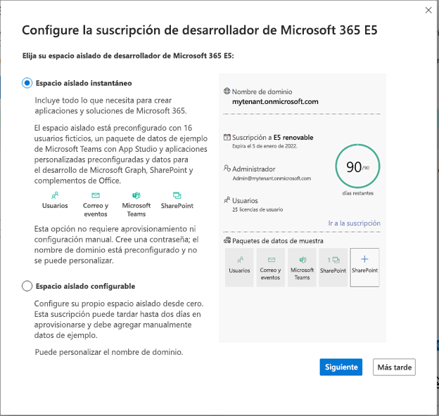

# Configurar una suscripción de espacio aislado para desarrolladores de Microsoft 365 

Configure una suscripción de Microsoft 365 Developer para crear soluciones independientes de su entorno de producción. La pertenencia al programa de desarrolladores, a la que se une como miembro normal o a través de Visual Studio enterprise, incluye una suscripción de espacio aislado para desarrolladores de Microsoft 365 E5 con 25 licencias de usuario. Tiene una duración de 90 días y es gratuita solo para fines de desarrollo (codificación de soluciones). No se admiten las transacciones comerciales, incluidos los servicios de pago de compra.

> [!NOTE] 
> Para configurar una suscripción, primero debe [unirse al programa de desarrolladores de Microsoft 365](microsoft-365-developer-program.md) directamente o a través de Visual Studio Professional o Enterprise (si es suscriptor). Después de unirse, verá la opción para configurar una suscripción.

Puede optar por configurar un espacio aislado instantáneo o un espacio aislado configurable.

## Espacio aislado instantáneo

Si elige un espacio aislado instantáneo, puede reducir el tiempo de configuración del espacio aislado de días a segundos. El espacio aislado instantáneo de Microsoft 365 viene aprovisionado previamente con Microsoft Teams, SharePoint, Outlook y Office. También incluye licencias para 24 usuarios de prueba más un administrador y las aplicaciones de Microsoft 365 más recientes para su PC y Mac, incluidos Power Apps, Power BI, Enterprise Mobility + Security, Protección contra amenazas avanzada de Office 365 y Azure Active Directory.

Además, obtendrá datos de ejemplo preinstalados, incluido el nuevo paquete de datos de ejemplo de Teams, así como Microsoft Graph datos de usuario, correo y calendario, y datos de ejemplo de SharePoint Framework, que simulan un pequeño entorno corporativo para ayudarle a crear soluciones en toda la plataforma Microsoft 365. Para obtener más información, consulte Los datos de ejemplo del espacio aislado para desarrolladores.

> [!VIDEO https://www.microsoft.com/en-us/videoplayer/embed/RWOmCY]

No puede personalizar el nombre de dominio si elige esta opción.

## Espacio aislado configurable

Si elige un espacio aislado configurable, puede personalizar el nombre de dominio. Tendrá un espacio aislado vacío que debe rellenar con datos de ejemplo. Este espacio aislado puede tardar hasta dos días en aprovisionarse. Puede instalar los paquetes de datos de ejemplo uno por uno que están disponibles en el panel del programa para desarrolladores. Para obtener más información, consulte Los datos de ejemplo del espacio aislado para desarrolladores.

## Configurar su suscripción de espacio aislado de Microsoft 365 E5

Configurar una suscripción de desarrollador de Microsoft 365:

1. En la página de perfil, elija **Configurar suscripción E5**.

2. En el cuadro de diálogo **Configurar la suscripción de desarrollador de Microsoft 365 E5**, elige si quieres un espacio aislado instantáneo o un espacio aislado configurable y, a continuación, elige **Next**.

    

Si seleccionó un espacio aislado instantáneo:

1.  Elija el **Country/region para el centro de datos**, y proporcione un **Admin username** y **Admin password** y, opcionalmente, una contraseña alternativa para los usuarios ficticios, y, a continuación, elija **Continue**.

    > [!IMPORTANT] 
    > Anote el nombre de usuario y contraseña porque los necesitará para acceder a su suscripción de desarrollador.

2.  Proporcione un número de teléfono móvil válido y elija **Enviar código**. Escriba el código que recibe y, a continuación, elija **Configurar**.

    > [!NOTE] 
    > Debe usar un número de teléfono móvil válido y no voz sobre IP (VoIP).

3.  Después de crear la suscripción, el nombre y la fecha de expiración de su suscripción aparecerán en la página de perfil.

Si seleccionó un espacio aislado configurable:

1.  Elija su **Country/region**, y, a continuación, proporcione un nombre de usuario en el campo **Crear nombre de usuario** y un nombre de dominio en el **Crear campo de dominio**. Cree y confirme la contraseña y, a continuación, elija **Continue**.

    > [!IMPORTANT] 
    > Anote el nombre de usuario y contraseña porque los necesitará para acceder a su suscripción de desarrollador.

2.  Proporcione un número de teléfono móvil válido y elija **Enviar código**. Escriba el código que recibe y, a continuación, elija **Configurar**.
3.  Después de crear la suscripción, el nombre y la fecha de expiración de su suscripción aparecerán en la página de perfil.

## Cambiar la configuración de la suscripción

1. En la página de perfil, seleccione **Ir a la suscripción** e inicie sesión con su Id. de usuario (por ejemplo, nombredeusuario@dominio.onmicrosoft.com) y la contraseña que especificó para su suscripción de desarrollador.

   > [!NOTE] 
   > No inicie sesión en su suscripción con las credenciales del programa de desarrolladores.

2. Use el iniciador de aplicaciones para ir al [Centro de administración](https://admin.microsoft.com/AdminPortal/Home#/homepage).

3. En la página principal del centro de administración, elija **Ir a la configuración**. Esto le llevará a la página de configuración para **desarrolladores de Microsoft 365 E5**.

4. **Instalar las aplicaciones de Office**. Tiene la opción de instalar las aplicaciones de Office en su equipo. Cuando esté listo, elija **Continue**.

5. **Personalizar el inicio de sesión y correo electrónico**. Puede conectar su suscripción a un dominio o usar el subdominio existente que ha creado. Cuando esté listo, elija **Use este dominio** o elija **Haga esto más adelante**.

6. **Agregar nuevos usuarios**. Puede agregar usuarios ficticios o reales que le ayuden con el desarrollo. Cuando esté listo, elija **Agregar usuarios y asignar licencias**.
    
    > [!NOTE]
    > Si tiene una suscripción configurable, después de configurar la suscripción, puede instalar el paquete de datos de ejemplo Usuarios. El paquete de datos de ejemplo de Usuarios crea 16 usuarios ficticios en su suscripción e incluye las licencias para cada usuario, los buzones de correo, los nombres, los metadatos y las fotos para cada uno. Para obtener más información, consulte [Datos de ejemplo de espacio aislado deDeveloper](install-sample-packs.md).

6. **Asignar licencias a los usuarios sin licencia**. Conceda una licencia a todos los usuarios que quiera que trabajen con la suscripción. Cuando esté listo, elija **Agregar usuarios y asignar licencias** o **Hacer esto más adelante**.

7. **Compartir las credenciales de inicio de sesión**. Debe compartir sus credenciales de inicio de sesión con los usuarios reales que tendrán acceso a la suscripción. Puede elegir un método, como enviar por correo electrónico, descargar o imprimir. Cuando esté listo, elija **Continue**.

   > [!TIP] 
   > En las siguientes visitas al panel, inicie sesión con su cuenta *nombredeusuario@dominio*.onmicrosoft.com antes de continuar al panel.

8. Elija si desea enviar un correo electrónico a los usuarios sobre Microsoft Teams y, a continuación, elija **Continuar**.

9. **Se ha alcanzado el final de la configuración**. Se ha completado la configuración de la suscripción. Opcionalmente, puede evaluar la experiencia. Cuando haya terminado, elija **Ir al centro de administración**.
    
   > [!NOTE] 
   > En este momento, la región por defecto de la suscripción es América del Norte, independientemente del país o región en que se encuentre. Es posible continuar con la configuración y el uso de la suscripción de desarrollador.

## Aprovisionar Microsoft 365 servicios en el espacio aislado configurable

Si tiene un espacio aislado configurable, los servicios de backend, como SharePoint y Exchange, tardarán algún tiempo en aprovisionar la suscripción. Durante este paso, algunos de los iconos del iniciador de aplicaciones y de la página principal se mostrarán como **Configurando (esta aplicación aún se está configurando)**. Esto no llevará más de una hora.

Al finalizar el aprovisionamiento, puede usar la nueva suscripción de Microsoft 365 para realizar tareas de desarrollo. La suscripción caduca después de 90 días. Para renovarla, consulte [¿puedo ampliar la suscripción cuando esté a punto de caducar?](microsoft-365-developer-program-faq.yml#renew-subscription)

También le recomendamos que habilite las opciones de publicación para asegurarse de tener acceso a las características más recientes de Microsoft 365 lo antes posible. Para obtener más información, vea [Configurar las opciones de la versión estándar o dirigida](https://support.office.com/article/set-up-the-standard-or-targeted-release-options-in-office-365-3b3adfa4-1777-4ff0-b606-fb8732101f47).

## Configurar una cuenta de Microsoft Azure

Para algunas soluciones de Office, es posible que necesite una cuenta de Microsoft Azure para compilar con los servicios de Azure. Esto no se incluye con la suscripción de desarrollador de Microsoft 365. Para configurar una cuenta gratuita de Azure, vea [Crear una cuenta gratuita de Azure hoy mismo](https://azure.microsoft.com/free/).

## Instalar paquetes de datos de ejemplo

Puede instalar paquetes de datos de ejemplo en el espacio aislado configurable. Si eligió el espacio aislado instantáneo, los paquetes de fecha de ejemplo vienen preinstalados.

Los paquetes de datos de ejemplo le ahorran tiempo al instalar automáticamente los datos y contenidos necesarios para crear y probar sus soluciones. Esto incluye usuarios, metadatos y fotografías ficticios para simular un pequeño entorno corporativo. Para obtener más información sobre los paquetes de datos de ejemplo disponibles y cómo instalarlos, vea [Instalar paquetes de datos de ejemplo](install-sample-packs.md).

## Vea también

- [Usar la suscripción para crear soluciones de Microsoft 365](build-microsoft-365-solutions.md)
- [Renovar una suscripción que va a expirar](subscription-expiration-and-renewal.md)
- [Preguntas frecuentes sobre el programa de desarrolladores de Microsoft 365](microsoft-365-developer-program-faq.yml)
