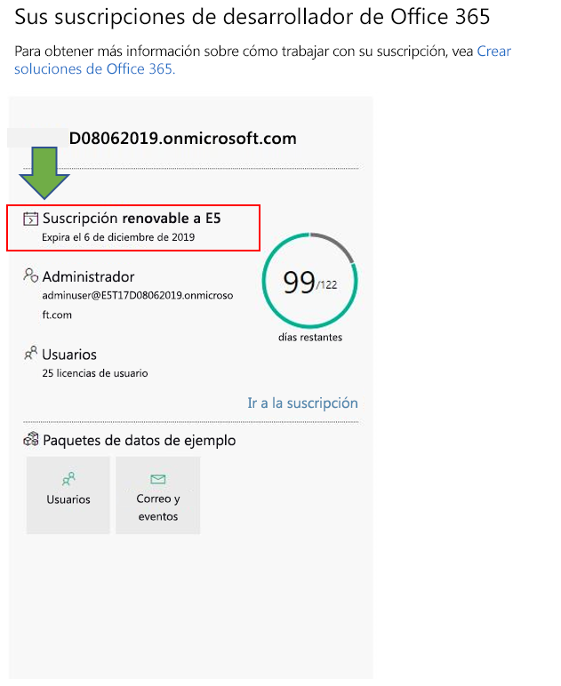

# Preguntas frecuentes del programa de desarrolladores de Office 365Office 365 Developer Program FAQ

Estos son las preguntas más frecuentes sobre el programa de desarrolladores de Office 365.The following are frequently asked questions about the Office 365 Developer Program.

## ¿Qué es el programa de desarrolladores de Office 365 y quién debería unirse a él?What is the Office 365 Developer Program and who should join it?

El programa de desarrolladores de Office 365 está diseñado para ayudarle a crear experiencias de productividad multiplataforma centradas en las personas que se extienden a Office 365.The Office 365 Developer Program is designed to help you build people-centric, cross-platform productivity experiences that extend Office 365. Únase a nuestro programa para obtener acceso a herramientas, documentación, formación, expertos y eventos de la comunidad que necesita para crear soluciones excelentes para productos y tecnologías de Office 365, incluidosJoin our program to get access to the tools, documentation, training, experts, and community events that you need to build great solutions for Office 365 products and technologies, including:

- los complementos web de [Excel](https://developer.microsoft.com/excel), [Outlook](https://developer.microsoft.com/outlook), [Word](https://developer.microsoft.com/word) y [PowerPoint](https://developer.microsoft.com/powerpoint)[Excel](https://developer.microsoft.com/excel), [Outlook](https://developer.microsoft.com/outlook), [Word](https://developer.microsoft.com/word), and [PowerPoint](https://developer.microsoft.com/powerpoint) web add-ins
- [SharePointSharePoint](https://developer.microsoft.com/sharepoint)
- [Microsoft TeamsMicrosoft Teams](https://developer.microsoft.com/microsoft-teams)
- [Microsoft GraphMicrosoft Graph](https://developer.microsoft.com/graph)

Como miembro del programa, puede obtener una suscripción de desarrollador de Office 365 gratuita con 25 licencias de usuario para crear sus soluciones.As a program member, you can get a free Office 365 developer subscription with 25 user licenses to use to build your solutions. Esta suscripción permanecerá activa mientras siga desarrollando e implementando soluciones de manera activa.This subscription will remain active for as long as you’re actively developing and deploying solutions.

Para obtener más información, vea [Unirse al programa de desarrolladores de Office 365](office-365-developer-program.md) y [Crear soluciones de Office 365](build-office-365-solutions.md).For more information, see [Join the Office 365 Developer Program](office-365-developer-program.md) and [Build Office 365 solutions](build-office-365-solutions.md).

## ¿Qué cuenta puedo usar para registrarme en el programa de desarrolladores de Office 365?What account can I use to sign up for the Office 365 Developer Program?

Puede registrarse en el programa de desarrolladores con uno de los siguientes tipos de cuenta:You can sign up for the developer program by using one of the following account types:

- **Cuenta de Microsoft** (creada personalmente para uso personal): proporciona acceso a todos los servicios en la nube y productos orientados al consumidor de Microsoft, como Outlook (Hotmail), Messenger, OneDrive, MSN, Xbox Live u Office 365.**Microsoft account** (created by you for personal use) - Provides access to all consumer-oriented Microsoft products and cloud services, such as Outlook (Hotmail), Messenger, OneDrive, MSN, Xbox Live, or Office 365. Al registrarse en un buzón de Outlook.com se crea automáticamente una cuenta de Microsoft.Signing up for an Outlook.com mailbox automatically creates a Microsoft account. Después de crear una cuenta de Microsoft, puede usarla para obtener acceso a los servicios en la nube de Microsoft relacionados con el consumidor o Azure.After a Microsoft account is created, it can be used to access consumer-related Microsoft cloud services or Azure. 
- **Cuenta profesional** (emitida por un administrador para su uso empresarial): proporciona acceso todos los servicios en la nube pequeños, medianos o de nivel empresarial de Microsoft, como Office 365, Microsoft Intune o Azure.**Work account** (issued by an admin for business use) - Provides access to all small, medium, and enterprise business-level Microsoft cloud services, such as Azure, Microsoft Intune, or Office 365. Cuando inicia sesión como una organización en uno de estos servicios, un directorio en la nube se aprovisiona automáticamente en Azure Active Directory para representar a su organización.When you sign up to one of these services as an organization, a cloud-based directory is automatically provisioned in Azure Active Directory to represent your organization. Para obtener más información, vea [Administrar el directorio de Azure AD](https://docs.microsoft.com/azure/active-directory/active-directory-administer).For more information, see [Manage your Azure AD directory](https://docs.microsoft.com/azure/active-directory/active-directory-administer).
- **Identificador Visual Studio** (creado para las suscripciones de Visual Studio Professional o Enterprise): le recomendamos que use esta opción para unirse al programa de desarrolladores desde la Galería de Visual Studio para aprovechar todas las ventajas que tienen los suscriptores a Visual Studio.**Visual Studio ID** (created for your Visual Studio Professional or Enterprise subscriptions) - We recommend that you use this option to join the developer program from within the Visual Studio Gallery to get the full benefits as a Visual Studio subscriber. 

## ¿Cómo puedo obtener una suscripción para desarrolladores de Office 365 a través del Programa de Desarrolladores?How can I get an Office 365 developer subscription via the Developer Program?  

Cuando se une al Programa de Desarrolladores de Office 365, reúnes los requisitos para obtener una suscripción gratuita para desarrolladores de Office 365.If you join the Office 365 Developer Program, you qualify to get a free Office 365 developer subscription. Esta es una suscripción especial diseñada para ser utilizada únicamente para el desarrollo de aplicaciones.This is a special subscription designed to be used for application development only, and comes with 25 user licenses. Para obtener más información, vea [Configurar una suscripción del programa de desarrolladores de Office 365](office-365-developer-program-get-started.md).For more information, see [Set up an Office 365 developer subscription](office-365-developer-program-get-started.md).

## ¿Qué Id. debo utilizar para iniciar sesión en el panel del programa para desarrolladores?What ID do I use to sign in to the Developer Program dashboard?

Utilice su Id. de miembro para iniciar sesión en el panel del programa para desarrolladores y acceder a la información sobre su suscripción.Use your member ID to sign in to the Developer Program dashboard to access information about your subscription. Esta es la cuenta de Microsoft o el correo electrónico habilitado de Azure Active Directory que usó para iniciar sesión cuando se unió al programa.This is the Microsoft account or Azure Active Directory-enabled email that you used to sign in when you joined the program.

## ¿Qué Id. debo utilizar para iniciar sesión a mi suscripción de desarrollador?What ID do I use to sign in to my developer subscription?

Utilice el Id. de administrador que creó al configurar su suscripción de desarrollador.Use the administrator ID that you created when you set up your developer subscription. Puede encontrar su Id. de administrador en la ventana de suscripción en el [panel del programa para desarrolladores](https://developer.microsoft.com/es-ES/office/profile).You can find your administrator ID on the subscription tile on the [Developer Program dashboard](https://developer.microsoft.com/es-ES/office/profile).

## ¿Qué incluye la suscripción de desarrollador?What's included in the Office 365 developer subscription?

Si creó la suscripción después del 25 de agosto de 2019, tiene una suscripción de Microsoft 365 E5 Developer con 25 licencias de usuario.If you created your subscription after August 25, 2019, you have a Microsoft 365 E5 Developer subscription with 25 user licenses. Los clientes que se han unido al programa antes del 25 de agosto de 2019, tienen una suscripción de Office 365 E3 Developer con 25 licencias de usuario.Customers who joined the program before August 25, 2019, have an Office 365 E3 Developer subscription with 25 user licenses.

La suscripción de Office 365 E3 Developer incluye lo siguiente:The Office 365 E3 Developer subscription includes the following:

- [Exchange Online (plan 2)Exchange Online (Plan 2)](https://products.office.com/exchange/compare-microsoft-exchange-online-plans)
- [Flow para Office 365Flow for Office 365 Plan 2](https://flow.microsoft.com/pricing/)
- [Information Protection para Office 365 - Estándar](https://products.office.com/es-ES/business/azure-information-protection-for-office-365)Information Protection for Office 365
- [Microsoft Forms (Plan E5)Microsoft Forms (Plan E5)](https://support.office.com/article/Frequently-asked-questions-about-Microsoft-Forms-495c4242-6102-40a0-add8-df05ed6af61c)
- [Microsoft PlannerMicrosoft Planner](https://products.office.com/compare-all-microsoft-office-products?tab=2)
- [Búsqueda de MicrosoftMicrosoft Search](https://products.office.com/en-us/business/intelligent-search?tab=Discovery)
- [Microsoft Stream para Office 365 E5 SKUMicrosoft Stream for O365 E5 SKU](https://products.office.com/business/office-365-enterprise-e5-business-software)
- [Microsoft TeamsMicrosoft Teams](https://products.office.com/business/office-365-enterprise-e5-business-software)
- [Administración de dispositivos móviles para Office 365Mobile Device Management for Office 365](https://support.office.com/article/Set-up-Mobile-Device-Management-MDM-in-Office-365-dd892318-bc44-4eb1-af00-9db5430be3cd)
- [Office 365 ProPlusOffice 365 ProPlus](https://products.office.com/business/office-365-proplus-business-software)
- [Office para la WebOffice for the web](https://docs.microsoft.com/es-ES/office365/servicedescriptions/office-online-service-description/office-online-service-description)
- [PowerApps para Office 365PowerApps for Office 365 Plan 2](https://powerapps.microsoft.com/pricing/)
- [SharePoint Online para desarrolladoresSharePoint Online for Developer](https://products.office.com/SharePoint/compare-sharepoint-plans)
- [Skype Empresarial Online (Plan 2)Skype for Business Online (Plan 2)](https://products.office.com/skype-for-business/online-meeting-solutions)
- [SwaySway](https://sway.com/)
- [Tareas pendientes (Plan 3)To-Do (Plan 3)](https://todo.microsoft.com)
- [Whiteboard (plan 2)Whiteboard (Plan 2)](https://products.office.com/es-ES/microsoft-whiteboard/digital-whiteboard-app)

La suscripción de Microsoft 365 E5 Developer contiene todas las aplicaciones que se incluyen en la suscripción de Office 365 E3 Developer, además de las siguientes características nuevas:The Microsoft 365 E5 Developer subscription includes all the apps that are included in the Office 365 E3 Developer subscription, plus the following new features:  

- Análisis avanzado con Power BIAdvanced analytics with Power BI  
- Enterprise Mobility + Security (EMS) para la protección de la información y el cumplimiento normativoEnterprise Mobility + Security (EMS) for compliance and information protection  
- Protección contra amenazas avanzada de Office 365Office 365 Advanced Threat Protection 
- Azure Active Directory para crear soluciones de administración de identidades y acceso avanzadasAzure Active Directory for building advanced identity and access management solutions  

La suscripción de Microsoft 365 E5 Developer incluye lo siguiente:The Microsoft 365 E5 Developer subscription includes the following: 

- Azure Active Directory Premium P1Azure Active Directory Premium 
- Azure Active Directory Premium P2Azure Active Directory Premium 
-   Azure Advanced Threat ProtectionAzure Advanced Threat Protection 
-   Azure Information Protection Premium P1Azure Information Protection Premium P1 
-   Azure Information Protection Premium P2Azure Information Protection Premium P2 
-   Caja de seguridad del clienteCustomer Lockbox 
-   Exchange Online (plan 2)Exchange Online (Plan 2) 
-   Flow para Office 365Flow for Office 365 Plan 2 
-   Information Protection para Office 365 - PremiumInformation Protection for Office 365 
-   Information Protection para Office 365 - EstándarInformation Protection for Office 365 
-   Microsoft Azure Active Directory RightsMicrosoft Azure Active Directory 
-   Microsoft Azure Multi-Factor AuthenticationMicrosoft Azure Active Directory Multi-Factor Authentication 
-   Microsoft Cloud App SecurityMicrosoft Cloud App Security 
-   Microsoft Forms (plan E5)Microsoft Forms (Plan E5) 
-   Microsoft IntuneMicrosoft Intune 
-   Microsoft MyAnalytics (Completo)Microsoft MyAnalytics (Full) 
-   Microsoft PlannerMicrosoft Planner 
-   Microsoft StaffHubMicrosoft StaffHub 
-   Microsoft Stream para O365 E5 SKUMicrosoft Stream for O365 E5 SKU 
-   Microsoft TeamsMicrosoft Teams 
-   Administración de dispositivos móviles para Office 365Mobile Device Management for Office 365 
-   eDiscovery avanzado de Office 365Office 365 Advanced eDiscovery 
-   Administración de seguridad avanzada de Office 365Office 365 Advanced Security Management 
-   Protección contra amenazas avanzada de Office 365 (plan 1)Office 365 Advanced Threat Protection 
-   Protección contra amenazas avanzada de Office 365 (plan 2)Office 365 Advanced Threat Protection 
-   Office 365 Privileged Access ManagementOffice 365 Privileged Access Management 
-   Office 365 ProPlusOffice 365 ProPlus 
-   Office OnlineOffice Online 
-   Sistema telefónicoPhone System 
-   Power BI ProPower BI Pro 
-   PowerApps para Office 365 (plan 3)PowerApps for Office 365 Plan 2 
-   SharePoint Online (plan 2)SharePoint Online Plan 2 
-   Skype Empresarial Online (Plan 2)Skype for Business Online (Plan 2) 
-   SwaySway 
-   To-Do (plan 3)To-Do (Plan 3) 
-   Whiteboard (plan 3)Whiteboard (Plan 3) 
-   Yammer EnterpriseYammer Enterprise 

Puede determinar si tiene una suscripción de Microsoft 365 E5 o una suscripción de Office 365 E3 en la ventana de suscripción en su [panel](https://developer.microsoft.com/office/profile).You can determine whether you have a Microsoft 365 E5 subscription or an Office 365 E3 subscription on the subscription tile on your [dashboard](https://developer.microsoft.com/office/profile). El icono mostrará E3 o E5 debajo del nombre de dominio de la suscripción.The tile will show either E3 or E5 under the subscription domain name.

.

## ¿La suscripción también incluye una suscripción a Azure?Does the subscription also include a subscription to Azure?

Esta oferta no incluye una suscripción a Azure.This offer does not include a subscription to Azure. Sin embargo, para recibir acceso gratuito a los servicios de Azure, puede [crear una cuenta gratuita de Azure](https://azure.microsoft.com/free/).However, to receive free access to Azure services, you can [create a free Azure account](https://azure.microsoft.com/free/). 

## ¿Cuántas licencias de usuario incluye la suscripción para desarrolladores de Office 365?How many user licenses does the Office 365 developer subscription include?

La suscripción para desarrolladores de Office 365 incluye 25 licencias de usuario, incluido el administrador, únicamente con fines de desarrollo.Your Office 365 developer subscription includes 25 user licenses, including the administrator, for development purposes only. Si usa esta suscripción con otros fines que no sean el desarrollo de aplicaciones, estará infringiendo el contrato de licencia.Using this subscription for any purpose other than application development is a violation of the license agreement. Para obtener más información sobre las restricciones de licencias, vea los [términos de uso de la suscripción de desarrollador de Office 365](terms-and-conditions.md).For more details about the licensing restrictions, see the [Office 365 developer subscription terms of use](terms-and-conditions.md).

## ¿Cuánto tiempo dura mi suscripción y cuándo caduca?How long is my subscription good for, and when does it expire?

La suscripción dura 90 días y puede renovarse en función de la actividad de desarrollo válida.Your subscription is good for 90 days and is renewable based on valid developer activity. Si usa la suscripción para tareas de desarrollo, se renovará cada 3 meses y durará de manera indefinida.If you're using your subscription for development, it will be renewed every 3 months and will last indefinitely. Encontrará la fecha de expiración, junto con el nombre de la suscripción, en el [panel del programa de desarrolladores de Office 365](https://developer.microsoft.com/es-ES/office/profile).You can find the expiration date, along with your subscription name, on your [Office 365 Developer Program dashboard](https://developer.microsoft.com/es-ES/office/profile). Para obtener más información, vea [Expiración y renovación de la suscripción](subscription-expiration-and-renewal.md).For more information, see [Subscription expiration and renewal](subscription-expiration-and-renewal.md).

Si desea unirse al programa a través de Visual Studio Enterprise o Visual Studio Professional, la suscripción se renovará automáticamente hasta que expire su suscripción a Visual Studio.If you're joining the program through Visual Studio Enterprise or Visual Studio Professional, your subscription is automatically renewed until your Visual Studio subscription expires. 

## ¿Por qué no se ofrece una suscripción de un año?Why don’t you offer a one-year subscription?

En abril de 2019, se realizó la transición a un nuevo modelo en el que la suscripción se puede renovar permanentemente cada 90 días si se usa activamente para el desarrollo.In April 2019, we transitioned to a new model where your subscription can be renewed perpetually every 90 days if you're actively using it for development. Creemos que este modelo garantiza que los desarrolladores que estén desarrollando activamente soluciones tengan una suscripción mientras la necesiten.We believe that this model ensures that developers who are actively developing solutions have a subscription for as long as they need one. Si desarrolla soluciones con frecuencia, la suscripción no expira nunca; se renueva automáticamente.If you're developing frequently, your subscription never expires; it is automatically extended. Si trabaja en tareas de desarrollo durante un tiempo y la suscripción expira y se elimina, siempre puede volver a registrarse para crear una nueva.If you're developing for a short time, and your subscription expires and is deleted, you can sign up for a new one. 

Si prefiere una suscripción que esté disponible durante un período más largo, le recomendamos la suscripción de Visual Studio Professional o Visual Studio Enterprise.If you prefer to have a subscription that is available for a longer time, we recommend that you get the Visual Studio Professional or Visual Studio Enterprise subscription. Estos programas incluyen una suscripción de desarrollador de Office 365 gratuita que es válida durante la duración de la suscripción de Visual Studio.These programs include a free Office 365 developer subscription that is good for the life of your Visual Studio subscription. Para acceder, vaya a [Visual Studio | Mis ventajas](https://my.visualstudio.com/benefits).To access this, go to [Visual Studio | My Benefits](https://my.visualstudio.com/benefits). Para obtener más información, póngase en contacto con [atención al cliente de Visual Studio](https://www.visualstudio.com/subscriptions/support/).For more information, contact [Visual Studio customer service](https://www.visualstudio.com/subscriptions/support/). 

## ¿Cómo determinar si se puede renovar una suscripción?How do you determine whether a subscription can be renewed?

Usamos un conjunto de algoritmos y telemetría que recibimos de su registro de actividad en el programa de desarrolladores de Office 365 y de su suscripción de desarrollador de Office 365 para determinar si está desarrollando activamente.We use a set of algorithms and telemetry that we get from your activity in the Office 365 Developer Program and on your Office 365 developer subscription to determine whether you are actively developing. Comprobamos estos datos periódicamente para actualizar el estado y determinar si debe ampliarse la suscripción.We check these regularly to update your status and determine whether your subscription should be extended. 

Si cree que nuestro seguimiento no refleja en algún modo su actividad de desarrollo con precisión, háganoslo saber a través del panel.If you think we somehow missed tracking your development activity accurately, you can let us know via your dashboard. Para enviar un formulario que nos indique cómo usa su suscripción para tareas de desarrollo, en la advertencia del panel, elija el vínculo **Háganoslo saber**, como se muestra en la siguiente imagen.To submit a form that tells us how you are using your subscription for development, in the dashboard warning, choose the **Let us know** link, as shown in the following image. Revisaremos su solicitud y le informamos si reúne las condiciones para una extensión.We will review your request and let you know if you qualify for an extension. 

 

## ¿Cómo se define la actividad de desarrollo?How do you define development activity?

Su actividad en el programa de desarrolladores de Office 365 y su suscripción de desarrollador de Office 365 determinan si está desarrollando activamente y si debería renovarse su suscripción.Your activity in the Office 365 Developer Program and on your Office 365 developer subscription determine whether you are actively developing and whether your subscription should be extended. 

Para obtener más información sobre los tipos de actividades que realizamos, vea los [términos de uso de la suscripción de desarrollador de Office 365](terms-and-conditions.md).For more information about the types of activities that we track, see the [Office 365 developer subscription terms of use](terms-and-conditions.md). 

## ¿Puedo ampliar la suscripción cuando esté a punto de expirar?When my subscription is about to expire, can I extend it?

La única forma de ampliar su suscripción es trabajando en tareas de desarrollo válidas.The only way that you can extend your subscription is to do valid developer activity. Si usa su suscripción para desarrollar soluciones personalizadas, la suscripción expirará y acabará por eliminase.If you're using your subscription to develop custom solutions, your subscription will expire and will eventually be deleted. 

Para obtener más información, vea [Expiración y renovación de la suscripción](subscription-expiration-and-renewal.md).For more information, see [Subscription expiration and renewal](subscription-expiration-and-renewal.md).

## Si la suscripción va a expirar, ¿cuánto tiempo tengo antes de que se elimine?If my subscription is going to expire, how much time do I have before it is deleted?

Una vez que expire la suscripción, tiene 30 días para migrar los datos.You have 30 days after your subscription expires to migrate any data. Durante esos 30 días, solo el administrador tendrá acceso a la suscripción y, tras 60 días, se eliminarán todos los datos y la suscripción.For the next 30 days, only the admin will have access to the subscription, and on day 60, the subscription and all data will be deleted.

## ¿Cómo puedo migrar de una suscripción de Office 365 E3 a una suscripción de Microsoft 365 E5?How can I migrate from an Office 365 E3 subscription to a Microsoft 365 E5 subscription?

Actualmente, solo los nuevos miembros del programa Office 365 Developer recibirán una suscripción de Microsoft 365 E5 Developer automáticamente.Currently, only new Office 365 Developer Program members will get a Microsoft 365 E5 Developer subscription automatically. En el futuro, se ofrecerá a los usuarios existentes un método para migrar a una suscripción de Microsoft 365 E5.Existing users will be offered a way to migrate to a Microsoft 365 E5 subscription in the future. Quédese tranquilo, estamos trabajando para que todos los miembros del programa Office 365 Developer puedan migrar a Microsoft 365 E5.Rest assured, we are working to enable all Office 365 Developer Program members to migrate to Microsoft 365 E5. 

## ¿Puedo elegir si tener una suscripción de Office 365 E3 o Microsoft 365 E5?Can I choose whether to have an Office 365 E3 or a Microsoft 365 E5 subscription?

Actualmente, solo se ofrece una suscripción de Microsoft 365 E5 a los nuevos miembros del programa de desarrolladores.Currently, only new Developer Program members are offered a Microsoft 365 E5 subscription. Los miembros existentes con una suscripción de Office 365 E3 tendrán la opción de mantener la suscripción actual y seguir renovándola si no necesitan las nuevas funciones ofrecidas en Microsoft 365 E5.Existing members with an Office 365 E3 subscription will have the option to keep their current subscription and continue to renew it if they don't need the new capibilities offered in Microsoft 365 E5. Los miembros del programa de desarrolladores solo pueden tener una suscripción.Developer program members can only have one subscription.  

Cuando tengamos una opción de migración para los miembros actuales del programa de desarrolladores, le proporcionaremos más información sobre cómo realizar la migración.When we have a migration option for existing Developer Program members, we’ll provide more information about how to migrate. 

## Como partner de Microsoft, ¿puedo recibir una suscripción?As a Microsoft Partner, can I receive a subscription? 

Sí, puede seguir [estas instrucciones](office-365-developer-program.md) para unirse al programa de desarrolladores de Office 365 y configurar una suscripción de desarrollador de Office 365.Yes, you can follow [these instructions](office-365-developer-program.md) to join the Office 365 Developer Program and set up an Office 365 developer subscription. Sin embargo, si ya tiene una suscripción de Visual Studio Enterprise o Visual Studio Professional (MSDN), puede obtener una suscripción de desarrollador de Office 365 como beneficio.However, if you already have a Visual Studio Enterprise or Visual Studio Professional (MSDN) subscription, you can get an Office 365 developer subscription as a benefit. Para acceder, vaya a [Visual Studio | Mis ventajas](https://my.visualstudio.com/benefits).To access this, go to [Visual Studio | My Benefits](https://my.visualstudio.com/benefits). Para obtener más información, póngase en contacto con [atención al cliente de Visual Studio](https://www.visualstudio.com/subscriptions/support/).For more information, contact [Visual Studio customer service](https://www.visualstudio.com/subscriptions/support/). 

## Como empleado a tiempo completo de Microsoft, ¿puedo recibir una suscripción?As a full-time Microsoft employee, can I receive a subscription?

Los empleados de Microsoft no pueden inscribirse en esta oferta.Microsoft employees cannot sign up for this offer. Sin embargo, todos los empleados a tiempo completo de Microsoft tienen acceso a una suscripción gratuita de Visual Studio (MSDN) que incluye el acceso a Office E3 Developer.However, all Microsoft full-time employees have access to a free Visual Studio (MSDN) subscription that includes access to Office E3 Developer. Puede acceder a este beneficio en [Visual Studio | Mis beneficios](https://my.visualstudio.com/benefits).You can access this benefit at [Visual Studio | My Benefits](https://my.visualstudio.com/benefits).

## Como proveedor que trabaja en Microsoft, ¿puedo optar a una suscripción?As a vendor working at Microsoft, do I qualify for a subscription?

Sí, puede seguir [estas instrucciones](office-365-developer-program.md) para unirse al programa de desarrolladores de Office 365 y configurar una suscripción de desarrollador de Office 365.Yes, you can follow [these instructions](office-365-developer-program.md) to join the Office 365 Developer Program and set up an Office 365 developer subscription. Pero, incluso para los proveedores, esta suscripción está diseñada para usarse _solo para el desarrollo de aplicaciones_.But even for vendors, this subscription is designed to be used _for application development only_. Si no está realizando las tareas de desarrollo válidas, no se renovará la suscripción.If you are not doing valid development activity, your subscription will not be renewed.

## ¿Está el programa de desarrolladores de Office 365 disponible en mi idioma?Is the Office 365 Developer Program available in my language?

Además del inglés, el programa de desarrolladores de Office 365 está disponible en los siguientes idiomas: chino (simplificado), francés, alemán, japonés, portugués (Brasil), ruso y español.In addition to English, the Office 365 Developer Program is available in the following languages: Chinese (Simplified), French, German, Japanese, Portuguese (Brazil), Russian, and Spanish.

## ¿Está la suscripción de desarrollador de Office 365 disponible en mi idioma?Is the Office 365 developer subscription available in my language?

La suscripción de desarrollador de Office 365 solo está disponible en inglés.The Office 365 developer subscription is only offered in English.

## Soporte técnicoSupport

Si tiene problemas con la configuración de la suscripción, vea los siguientes recursos de soporte técnico:If you have issues setting up your subscription, see the following support resources:

- [Stack OverflowStack Overflow](https://stackoverflow.com/questions)   
- [Atención al cliente de Visual StudioVisual Studio customer service](https://www.visualstudio.com/subscriptions/support/)

## Vea tambiénSee also

- [Unirse al programa de desarrolladores de Office 365Join the Office 365 Developer Program](office-365-developer-program.md)
- [Configurar una suscripción del programa de desarrolladores de Office 365Set up an Office 365 developer subscription](office-365-developer-program-get-started.md)
- [Usar la suscripción para crear soluciones de Office 365Use your subscription to build Office 365 solutions](build-office-365-solutions.md)
- [Renovar una suscripción que va a expirarRenew an expiring subscription](subscription-expiration-and-renewal.md)

 

 

 

 

 

 
