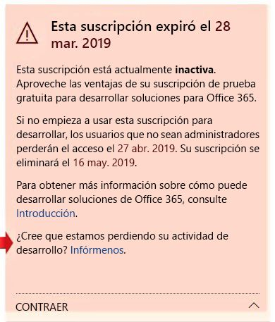

# Preguntas frecuentes del programa de desarrolladores de Office 365Office 365 Developer Program FAQ

Estos son las preguntas más frecuentes sobre el programa de desarrolladores de Office 365.The following are frequently asked questions about the Office 365 Developer Program.

## ¿Qué es el programa de desarrolladores de Office 365 y quién debería unirse a él?What is the Office 365 Developer Program and who should join it?

El programa de desarrolladores de Office 365 está diseñado para ayudarle a crear experiencias de productividad multiplataforma centradas en las personas que se extienden a Office 365.The Office 365 Developer Program is designed to help you build people-centric, cross-platform productivity experiences that extend Office 365. Únase a nuestro programa para obtener acceso a herramientas, documentación, formación, expertos y eventos de la comunidad que necesita para crear soluciones excelentes para productos y tecnologías de Office 365, incluidosJoin our program to get access to the tools, documentation, training, experts, and community events that you need to build great solutions for Office 365 products and technologies, including:

- los complementos web de [Excel](https://developer.microsoft.com/excel), [Outlook](https://developer.microsoft.com/outlook), [Word](https://developer.microsoft.com/word) y [PowerPoint](https://developer.microsoft.com/powerpoint)[Excel](https://developer.microsoft.com/excel), [Outlook](https://developer.microsoft.com/outlook), [Word](https://developer.microsoft.com/word), and [PowerPoint](https://developer.microsoft.com/powerpoint) web add-ins
- [SharePointSharePoint](https://developer.microsoft.com/sharepoint)
- [Microsoft TeamsMicrosoft Teams](https://developer.microsoft.com/microsoft-teams)
- [Microsoft GraphMicrosoft Graph](https://developer.microsoft.com/graph)

Como miembro del programa, puede obtener una suscripción de desarrollador de Office 365 gratuita con 25 licencias de usuario para crear sus soluciones.As a program member, you can get a free Office 365 developer subscription with 25 user licenses to use to build your solutions. Esta suscripción permanecerá activa mientras siga desarrollando e implementando soluciones de manera activa.This subscription will remain active for as long as you’re actively developing and deploying solutions.

Para obtener más información, vea [Unirse al programa de desarrolladores de Office 365](office-365-developer-program.md) y [Crear soluciones de Office 365](build-office-365-solutions.md).For more information, see [Join the Office 365 Developer Program](office-365-developer-program.md) and [Build Office 365 solutions](build-office-365-solutions.md).
 
## ¿Cómo funciona la suscripción de desarrollador de Office 365?How does the Office 365 developer subscription work?  

Si se une al programa de desarrolladores de Office 365, puede obtener una suscripción de desarrollador de Office 365.If you join the Office 365 Developer Program, you qualify to get a free Office 365 developer subscription. Esta es una suscripción especial diseñada para usarse solo para desarrollar aplicaciones e incluye 25 licencias de usuario.The Office 365 developer subscription is designed to be used for application development and testing only, and comes with 25 user licenses. 

Después de unirse al programa de desarrolladores de Office 365, tendrá la opción de recibir y configurar una suscripción de desarrollador de Office 365.After joining the Office 365 Developer Program, you'll have the option to receive and configure an Office 365 developer subscription. La suscripción es válida durante 90 días y se puede renovar otros 90, siempre que se use activamente para tareas de desarrollo.Your subscription is good for 90 days and can be renewed for another 90 days for as long as you're using it for development activity. 

Para obtener más información, vea [Configurar una suscripción del programa de desarrolladores de Office 365](office-365-developer-program-get-started.md).For more information, see [Set up an Office 365 developer subscription](office-365-developer-program-get-started.md).

## ¿Cuántas licencias de usuario puedo agregar a mi suscripción?How many licenses can I add with my subscription?

Puede agregar hasta 25 licencias de usuario, incluido el administrador, únicamente con fines de desarrollo.You can add up to 25 user licenses, including the administrator, for development purposes only. Si usa esta suscripción con otros fines que no sean el desarrollo de aplicaciones, estará infringiendo el contrato de licencia.Using this subscription for any purpose other than application development is a violation of the license agreement. Para obtener más información sobre las restricciones de licencias, vea los [términos de uso de la suscripción de desarrollador de Office 365](terms-and-conditions.md).For more details about the licensing restrictions, see the [Office 365 developer subscription terms of use](terms-and-conditions.md).

## ¿Por qué no se ofrece una suscripción de un año?Why don’t you offer a one-year subscription?

En abril de 2019, se realizó la transición a un nuevo modelo en el que la suscripción se puede renovar permanentemente cada 90 días si se usa activamente para el desarrollo.In April 2019, we transitioned to a new model where your subscription can be renewed perpetually every 90 days if you're actively using it for development. Creemos que este modelo garantiza que los desarrolladores que estén desarrollando activamente soluciones tengan una suscripción mientras la necesiten.We believe that this model ensures that developers who are actively developing solutions have a subscription for as long as they need one. Si desarrolla soluciones con frecuencia, la suscripción no expira nunca; se renueva automáticamente.If you're developing frequently, your subscription never expires; it is automatically extended. Si trabaja en tareas de desarrollo durante un tiempo y la suscripción expira y se elimina, siempre puede volver a registrarse para crear una nueva.If you're developing for a short time, and your subscription expires and is deleted, you can sign up for a new one. 

Si prefiere una suscripción que esté disponible durante un período más largo, le recomendamos la suscripción de Visual Studio Professional o Visual Studio Enterprise.If you prefer to have a subscription that is available for a longer time, we recommend that you get the Visual Studio Professional or Visual Studio Enterprise subscription. Estos programas incluyen una suscripción de desarrollador de Office 365 gratuita que es válida durante la duración de la suscripción de Visual Studio.These programs include a free Office 365 developer subscription that is good for the life of your Visual Studio subscription. Para acceder, vaya a [Visual Studio | Mis ventajas](https://my.visualstudio.com/benefits).To access this, go to [Visual Studio | My Benefits](https://my.visualstudio.com/benefits). Para obtener más información, póngase en contacto con [atención al cliente de Visual Studio](https://www.visualstudio.com/subscriptions/support/).For more information, contact [Visual Studio customer service](https://www.visualstudio.com/subscriptions/support/). 

## ¿Cómo determinar si se puede renovar una suscripción?How do you determine whether a subscription can be renewed?

Usamos un conjunto de algoritmos y telemetría que recibimos de su registro de actividad en el programa de desarrolladores de Office 365 y de su suscripción de desarrollador de Office 365 para determinar si está desarrollando activamente.We use a set of algorithms and telemetry that we get from your activity in the Office 365 Developer Program and on your Office 365 developer subscription to determine whether you are actively developing. Comprobamos estos datos periódicamente para actualizar el estado y determinar si debe ampliarse la suscripción.We check these regularly to update your status and determine whether your subscription should be extended. 

Si cree que nuestro seguimiento no refleja en algún modo su actividad de desarrollo con precisión, háganoslo saber a través del panel.If you think we somehow missed tracking your development activity accurately, you can let us know via your dashboard. Para enviar un formulario que nos indique cómo usa su suscripción para tareas de desarrollo, en la advertencia del panel, elija el vínculo **Háganoslo saber**, como se muestra en la siguiente imagen.To submit a form that tells us how you are using your subscription for development, in the dashboard warning, choose the **Let us know** link, as shown in the following image. Revisaremos su solicitud y le informamos si reúne las condiciones para una extensión.We will review your request and let you know if you qualify for an extension. 

 

## ¿Cómo se define la actividad de desarrollo?How do you define development activity?

Su actividad en el programa de desarrolladores de Office 365 y su suscripción de desarrollador de Office 365 determinan si está desarrollando activamente y si debería renovarse su suscripción.Your activity in the Office 365 Developer Program and on your Office 365 developer subscription determine whether you are actively developing and whether your subscription should be extended. 

## ¿Para qué tareas de desarrollo realiza un seguimiento?What development activities do you track?

Para obtener más información sobre los tipos de tareas para las que se realiza un seguimiento, consulte los [términos de uso de la suscripción de desarrollador de Office 365](terms-and-conditions.md).For more information about the types of activities that we track, see the [Office 365 developer subscription terms of use](terms-and-conditions.md). 

## ¿Qué incluye la suscripción de desarrollador de Office 365?What's included in the Office 365 developer subscription?

Su suscripción de desarrollador incluye lo siguiente:Your developer subscription includes the following:

- [Exchange Online (plan 2)Exchange Online Plan 2](https://products.office.com/exchange/compare-microsoft-exchange-online-plans)
- [Flow para Office 365 Plan 2Flow for Office 365 Plan 2](https://flow.microsoft.com/pricing/)
- [Microsoft Forms (plan E5)Microsoft Forms (Plan E5)](https://support.office.com/article/Frequently-asked-questions-about-Microsoft-Forms-495c4242-6102-40a0-add8-df05ed6af61c)
- [Microsoft PlannerMicrosoft Planner](https://products.office.com/compare-all-microsoft-office-products?tab=2)
- [Microsoft Stream para O365 E5 SKUMicrosoft Stream for O365 E5 SKU](https://products.office.com/business/office-365-enterprise-e5-business-software)
- [Microsoft TeamsMicrosoft Teams](https://products.office.com/business/office-365-enterprise-e5-business-software)
- [Administración de dispositivos móviles para Office 365Mobile Device Management for Office 365](https://support.office.com/article/Set-up-Mobile-Device-Management-MDM-in-Office-365-dd892318-bc44-4eb1-af00-9db5430be3cd)
- [Office 365 ProPlusOffice 365 ProPlus](https://products.office.com/business/office-365-proplus-business-software)
- [PowerApps para Office 365 Plan 2PowerApps for Office 365 Plan 2](https://powerapps.microsoft.com/pricing/)
- [SharePoint Online para DeveloperSharePoint Online for Developer](https://products.office.com/SharePoint/compare-sharepoint-plans)
- [Skype Empresarial Online (plan 2)Skype for Business Online Plan 2](https://products.office.com/skype-for-business/online-meeting-solutions)
- [SwaySway](https://sway.com/)
- [To-Do (plan 3)To-Do (Plan 3)](https://todo.microsoft.com)

## ¿La suscripción también incluye una suscripción a Azure?Does the subscription also include a subscription to Azure?

Esta oferta no incluye una suscripción a Azure.This offer does not include a subscription to Azure. Sin embargo, para recibir acceso gratuito a los servicios de Azure, puede [crear una cuenta gratuita de Azure](https://azure.microsoft.com/free/).However, to receive free access to Azure services, you can [create a free Azure account](https://azure.microsoft.com/free/). 

## ¿Cuánto tiempo dura mi suscripción y cuándo caduca?How long is my subscription good for, and when does it expire?

La suscripción dura 90 días y puede renovarse en función de la actividad de desarrollo válida.Your subscription is good for 90 days and is renewable based on valid developer activity. Si usa la suscripción para tareas de desarrollo, se renovará cada 3 meses y durará de manera indefinida.If you're using your subscription for development, it will be renewed every 3 months and will last indefinitely. Encontrará la fecha de expiración, junto con el nombre de la suscripción, en el [panel del programa de desarrolladores de Office 365](https://developer.microsoft.com/es-ES/office/profile).You can find the expiration date, along with your subscription name, on your Office 365 Developer Program profile page. Para obtener más información, vea [Expiración y renovación de la suscripción](subscription-expiration-and-renewal.md).For more information, see [Subscription expiration and renewal](subscription-expiration-and-renewal.md).

Si desea unirse al programa a través de Visual Studio Enterprise o Visual Studio Professional, la suscripción se renovará automáticamente hasta que expire su suscripción a Visual Studio.If you're joining the program through Visual Studio Enterprise or Visual Studio Professional, your subscription is automatically renewed until your Visual Studio subscription expires. 

## ¿Puedo ampliar la suscripción cuando esté a punto de expirar?When my subscription is about to expire, can I extend it?

La única forma de ampliar su suscripción es trabajando en tareas de desarrollo válidas.The only way that you can extend your subscription is to do valid developer activity. Si usa su suscripción para desarrollar soluciones personalizadas, la suscripción expirará y acabará por eliminase.If you're using your subscription to develop custom solutions, your subscription will expire and will eventually be deleted. 

Para obtener más información, vea [Expiración y renovación de la suscripción](subscription-expiration-and-renewal.md).For more information, see [Subscription expiration and renewal](subscription-expiration-and-renewal.md).

## Si la suscripción va a expirar, ¿cuánto tiempo tengo antes de que se elimine?If my subscription is going to expire, how much time do I have before it is deleted?

Una vez que expire la suscripción, tiene 30 días para migrar los datos.You have 30 days after your subscription expires to migrate any data. Durante esos 30 días, solo el administrador tendrá acceso a la suscripción y, tras 60 días, se eliminarán todos los datos y la suscripción.For the next 30 days, only the admin will have access to the subscription, and on day 60, the subscription and all data will be deleted.

## ¿Qué cuenta puedo usar para registrarme en el programa de desarrolladores de Office 365?What account can I use to sign up for the developer program?

Puede registrarse en el programa de desarrolladores con uno de los siguientes tipos de cuenta:You can sign up for the developer program by using one of the following account types:

- **Cuenta de Microsoft** (creada personalmente para uso personal): proporciona acceso a todos los servicios en la nube y productos orientados al consumidor de Microsoft, como Outlook (Hotmail), Messenger, OneDrive, MSN, Xbox Live u Office 365.**Microsoft account** (created by you for personal use) - Provides access to all consumer-oriented Microsoft products and cloud services, such as Outlook (Hotmail), Messenger, OneDrive, MSN, Xbox Live, or Office 365. Al registrarse en un buzón de Outlook.com se crea automáticamente una cuenta de Microsoft.Signing up for an Outlook.com mailbox automatically creates a Microsoft account. Después de crear una cuenta de Microsoft, puede usarla para obtener acceso a los servicios en la nube de Microsoft relacionados con el consumidor o Azure.After a Microsoft account is created, it can be used to access consumer-related Microsoft cloud services or Azure. 
- **Cuenta profesional** (emitida por un administrador para su uso empresarial): proporciona acceso todos los servicios en la nube pequeños, medianos o de nivel empresarial de Microsoft, como Office 365, Microsoft Intune o Azure.**Work or school account** (issued by an admin for business/academic use) - Provides access to all small, medium, and enterprise business-level Microsoft cloud services, such as Azure, Microsoft Intune, or Office 365. Cuando inicia sesión como una organización en uno de estos servicios, un directorio en la nube se aprovisiona automáticamente en Azure Active Directory para representar a su organización.When you sign up to one of these services as an organization, a cloud-based directory is automatically provisioned in Azure Active Directory to represent your organization. Para obtener más información, vea [Administrar el directorio de Azure AD](https://docs.microsoft.com/azure/active-directory/active-directory-administer).For more information, see [Manage your Azure AD directory](https://docs.microsoft.com/azure/active-directory/active-directory-administer).
- **Identificador Visual Studio** (creado para las suscripciones de Visual Studio Professional o Enterprise): le recomendamos que use esta opción para unirse al programa de desarrolladores desde la Galería de Visual Studio para aprovechar todas las ventajas que tienen los suscriptores a Visual Studio.**Visual Studio ID** (created for your Visual Studio Professional or Enterprise subscriptions) - We recommend that you use this option to join the developer program from within the Visual Studio Gallery to get the full benefits as a Visual Studio subscriber. 
 
## Como partner de Microsoft, ¿puedo recibir una suscripción?As a Microsoft Partner, can I receive a subscription? 

Sí, puede seguir [estas instrucciones](office-365-developer-program.md) para unirse al programa de desarrolladores de Office 365 y configurar una suscripción de desarrollador de Office 365.Yes, you can follow [these instructions](office-365-developer-program.md) to join the Office 365 Developer Program and set up an Office 365 developer subscription. Sin embargo, si ya tiene una suscripción de Visual Studio Enterprise o Visual Studio Professional (MSDN), puede obtener una suscripción de desarrollador de Office 365 como beneficio.However, if you already have a Visual Studio Enterprise (MSDN) subscription, you can get an Office 365 developer subscription as a benefit. Para acceder, vaya a [Visual Studio | Mis ventajas](https://my.visualstudio.com/benefits).To access this, go to [Visual Studio | My Benefits](https://my.visualstudio.com/benefits). Para obtener más información, póngase en contacto con [atención al cliente de Visual Studio](https://www.visualstudio.com/subscriptions/support/).For more information, contact [Visual Studio customer service](https://www.visualstudio.com/subscriptions/support/). 

## Como empleado a tiempo completo de Microsoft, ¿puedo recibir una suscripción?As a Microsoft full-time employee, can I receive a subscription?

Los empleados de Microsoft no pueden inscribirse en esta oferta.Microsoft employees cannot sign up for this offer. Sin embargo, todos los empleados a tiempo completo de Microsoft tienen acceso a una suscripción gratuita de Visual Studio (MSDN) que incluye el acceso a Office E3 Developer.However, all Microsoft full-time employees have access to a free Visual Studio (MSDN) subscription that includes access to Office E3 Developer. Puede acceder a este beneficio en [Visual Studio | Mis beneficios](https://my.visualstudio.com/benefits).You can access this benefit at [Visual Studio | My Benefits](https://my.visualstudio.com/benefits).

## Como proveedor que trabaja en Microsoft, ¿puedo optar a una suscripción?As a vendor working at Microsoft, do I qualify for a subscription?

Sí, puede seguir [estas instrucciones](office-365-developer-program.md) para unirse al programa de desarrolladores de Office 365 y configurar una suscripción de desarrollador de Office 365.Yes, you can follow [these instructions](office-365-developer-program.md) to join the Office 365 Developer Program and set up an Office 365 developer subscription. Pero, incluso para los proveedores, esta suscripción está diseñada para usarse _solo para el desarrollo de aplicaciones_.But even for vendors, this subscription is designed to be used _for application development only_. Si no está realizando las tareas de desarrollo válidas, no se renovará la suscripción.If you are not doing valid development activity, your subscription will not be renewed.

## ¿Está el programa de desarrolladores de Office 365 disponible en mi idioma?Is the Office 365 Developer Program available in my language?

Además del inglés, el programa de desarrolladores de Office 365 está disponible en los siguientes idiomas: chino (simplificado), francés, alemán, japonés, portugués (Brasil), ruso y español.In addition to English, the Office 365 Developer Program is available in the following languages: Chinese (Simplified), French, German, Japanese, Portuguese (Brazil), Russian, and Spanish.

## ¿Está la suscripción de desarrollador de Office 365 disponible en mi idioma?Is the Office 365 developer subscription available in my language?

La suscripción de desarrollador de Office 365 solo está disponible en inglés.The Office 365 developer subscription is only offered in English.

## Soporte técnicoSupport

Si tiene problemas con la configuración de la suscripción, vea los siguientes recursos de soporte técnico:If you have issues setting up your subscription, please see the following support resources:

- [Stack OverflowStack Overflow forums](https://stackoverflow.com/questions)   
- [Atención al cliente de Visual StudioVisual Studio customer service](https://www.visualstudio.com/subscriptions/support/)

## Vea tambiénSee also

- [Unirse al programa de desarrolladores de Office 365Join the Office 365 Developer Program](office-365-developer-program.md)
- [Configurar una suscripción de desarrollador de Office 365Set up an Office 365 developer subscription](office-365-developer-program-get-started.md)
- [Usar la suscripción para crear soluciones de Office 365Use your subscription to build Office 365 solutions](build-office-365-solutions.md)
- [Renovar una suscripción que va a expirarRenew an expiring subscription](subscription-expiration-and-renewal.md)

 

 

 

 

 

 
