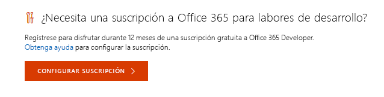
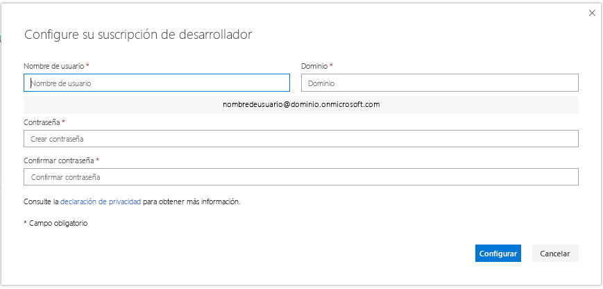
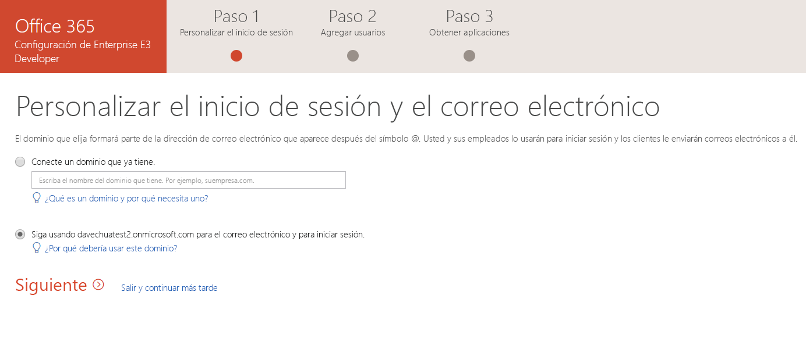
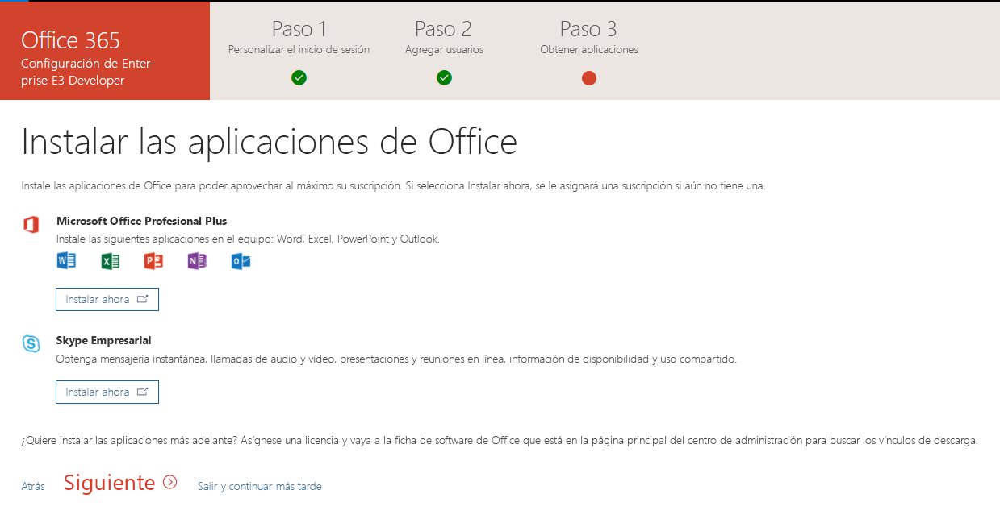

# Configurar una suscripción de desarrollador de Office 365 

Configure una suscripción de desarrolladores de Office 365 para crear soluciones independientes de su entorno de producción. La suscripción es una suscripción a Office 365 Enterprise E3 Developer con 25 licencias de usuario. Tiene una duración de 90 días y es gratuita para fines de desarrollo (codificación de soluciones).

> [!NOTE] 
> Para configurar una suscripción, primero debe [Unirse al programa de desarrolladores de Office 365](office-365-developer-program.md). Después de unirse, verá la opción para configurar una suscripción.

## Configurar la suscripción

1. Para obtener una suscripción de desarrolladores de Office 365, vaya a su página de perfil y en **¿Necesita una suscripción a Office 365 para labores de desarrollo?**, elija **Configurar suscripción**.

  

2. En el cuadro de diálogo **Configurar la suscripción de desarrollador**, cree un nombre de usuario y un dominio. Esta cuenta tendrá permisos de administrador global para la suscripción. Puede elegir cualquier nombre de dominio o nombre de usuario mientras no estén en uso. No use espacios.

  

3. Cree una contraseña y confírmela.

4. Elija **Configurar**.

5. Si se le pide que demuestre que no es un robot, siga las instrucciones y, a continuación, elija **Comprobar**.

6. Después de crear la suscripción, el nombre y la fecha de expiración de su suscripción aparecerán en la página de perfil.

  > [!IMPORTANT]
  > Anote el nombre de usuario y contraseña porque los necesitará para acceder a su suscripción de desarrollador.

## Cambiar la configuración de la suscripción

1. En la página de perfil, seleccione el vínculo [office.com](https://www.office.com/) e inicie sesión con su Id. de usuario (por ejemplo, nombredeusuario@dominio.onmicrosoft.com) y la contraseña que especificó para su suscripción de desarrollador.

   > [!NOTE] 
   > No inicie sesión en su suscripción con las credenciales del programa de desarrolladores.

2. Use el iniciador de aplicaciones para ir al [Centro de administración](https://portal.office.com/adminportal/home#/homepage).

3. En la página principal del centro de administración, elija **Ir a la configuración**. Esto le lleva a la página **Configuración de Office 365 Enterprise E3 Developer**.

4. **Personalizar el inicio de sesión y correo electrónico**. Puede conectar su suscripción a un dominio o usar el subdominio existente que ha creado. Cuando haya terminado, elija **Siguiente**.

  

5. **Agregar nuevos usuarios**. Puede agregar usuarios. Pueden ser usuarios ficticios o usuarios reales que le ayuden con el desarrollo. Cuando haya terminado, elija **Siguiente**.
    
  > [!NOTE]
  > Si necesita agregar usuarios en masa, puede hacerlo más adelante. Para obtener más información, vea [Agregar usuarios individualmente o de forma masiva a Office 365: ayuda para administradores](https://support.office.com/article/add-users-individually-or-in-bulk-to-office-365-admin-help-1970f7d6-03b5-442f-b385-5880b9c256ec).

6. **Asignar licencias a los usuarios sin licencia**. Conceda una licencia a todos los usuarios que quiera que trabajen con la suscripción. Cuando haya terminado, elija **Siguiente**.

7. **Compartir las credenciales de inicio de sesión**. Debe compartir sus credenciales de inicio de sesión con los usuarios reales que tendrán acceso a la suscripción. Puede elegir un método, como enviar por correo electrónico, descargar o imprimir. Cuando haya terminado, elija **Siguiente**.

8. **Instalar las aplicaciones de Office**. Tiene la opción de instalar las aplicaciones de Office en su equipo. Cuando haya terminado, elija **Siguiente**.

  

   > [!TIP] 
   > En las siguientes visitas al panel, inicie sesión con su cuenta *nombredeusuario@dominio*.onmicrosoft.com antes de continuar al panel.

9. **Se ha alcanzado el final de la configuración**. Se ha completado la configuración de la suscripción. Opcionalmente, puede evaluar la experiencia. Cuando haya terminado, elija **Ir al centro de administración**.
    
   > [!NOTE] 
   > En este momento, la región por defecto de la suscripción es América del Norte, independientemente del país o región en que se encuentre. Es posible continuar con la configuración y el uso de la suscripción de desarrollador.

## Servicios de aprovisionamiento de Office 365.

Los servicios de back-end, como SharePoint y Exchange, tardarán cierto tiempo en realizar el aprovisionamiento para la suscripción. Durante este paso, algunos de los iconos del iniciador de aplicaciones y de la página principal se mostrarán como **Configurando (esta aplicación aún se está configurando)**. Esto no llevará más de una hora.

Al finalizar el aprovisionamiento, puede usar la nueva suscripción de Office 365 para realizar tareas de desarrollo. La suscripción caduca después de 90 días. Para renovarla, consulte [¿puedo ampliar la suscripción cuando esté a punto de caducar?](office-365-developer-program-faq.md#renew-subscription)

También le recomendamos que habilite las opciones de publicación para asegurarse de que obtiene acceso a las características más recientes de Office 365 lo antes posible. Para obtener más información, vea [Configurar las opciones de la versión estándar o dirigida en Office 365](https://support.office.com/article/set-up-the-standard-or-targeted-release-options-in-office-365-3b3adfa4-1777-4ff0-b606-fb8732101f47).

## Configurar una cuenta de Microsoft Azure

Para algunas soluciones de Office, es posible que necesite una cuenta de Microsoft Azure para compilar con los servicios de Azure. Para configurar una cuenta gratuita de Azure, vea [Crear una cuenta gratuita de Azure hoy mismo](https://azure.microsoft.com/free/).

## Dejar el programa de desarrolladores de Office 365

Si decide que ya no desea participar en el programa de desarrolladores de Office 365, puede cancelar la suscripción y dejar el programa.

  > [!WARNING]
  > Los pasos siguientes borrarán toda la información de su perfil. Perderá los datos almacenados en su suscripción de desarrollador que no se copien en otro lugar.

1. Le damos la bienvenida al programa de desarrolladores de Office 365.

2. Elija **Eliminar perfil**.

3. En el cuadro de confirmación **Eliminar perfil**, seleccione **Eliminar**.

## Vea también

- [Unirse al programa de desarrolladores de Office 365](office-365-developer-program.md)
- [Usar la suscripción para crear soluciones de Office 365](build-office-365-solutions.md)
- [Renovar una suscripción que va a expirar](subscription-expiration-and-renewal.md)
- [Preguntas frecuentes del programa de desarrolladores de Office 365](office-365-developer-program-faq.md)
