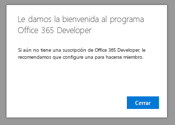

# Le damos la bienvenida al programa de desarrolladores de Office 365

Únase a sus amigos y compañeros en el programa de desarrolladores de Office 365. Use la suscripción de desarrolladores de Office 365 para desarrollar y probar las soluciones independientes de su entorno de producción. Puede crear soluciones para Microsoft Teams, complementos de Office, Microsoft Graph, SharePoint Framework, complementos de SharePoint y mucho más.

## Unirse al programa de desarrolladores de Office 365.

1. Vaya a la página [Unirse al programa de desarrolladores de Office 365](https://developer.microsoft.com/es-ES/office/dev-program). 

2. En la esquina superior derecha, elija **Iniciar sesión** para iniciar sesión con su cuenta de Microsoft o el correo electrónico habilitado para Azure Active Directory. 

  

3. Después de iniciar sesión, elija **Unirse ahora**.

4. En la página **Registro en el programa de desarrolladores de Office 365**, complete los siguientes campos en el formulario en línea:

  - **Correo electrónico de contacto**
  - **País o región**
  - **Empresa**

  

5. Revise los **términos y condiciones**. Debe seleccionar la casilla de verificación para unirse.

6. También puede seleccionar la casilla **Me gustaría informarme sobre el programa de desarrolladores de Office 365** si quiere informarse sobre las nuevas funcionalidades y otras actualizaciones de Microsoft. 

7. Elija **Siguiente**.

8. En la página **Preferencias del programa de desarrolladores de Office 365**, díganos sus preferencias para poder personalizar su experiencia, incluyendo:

  - El sector en el que trabaja.
  - El tipo de aplicaciones o soluciones que está interesado en desarrollar.
  - Los productos, tecnologías y lenguajes de programación que le interesan.

  

9. Cuando haya terminado, haga clic en **Unirse**. Las preferencias aparecerán en la página siguiente en la parte superior derecha y recibirá un mensaje de bienvenida.

  

## Pasos siguientes

- [Configurar una suscripción del programa de desarrolladores de Office 365](office-365-developer-program-get-started.md). 

- Cuando disponga de la suscripción de desarrolladores, [use su suscripción](build-office-365-solutions.md) para crear los tipos de soluciones que quiera.

- Para ver las preguntas más frecuentes sobre el programa de desarrolladores de Office 365, vea las [Preguntas más frecuentes](office-365-developer-program-faq.md). 
