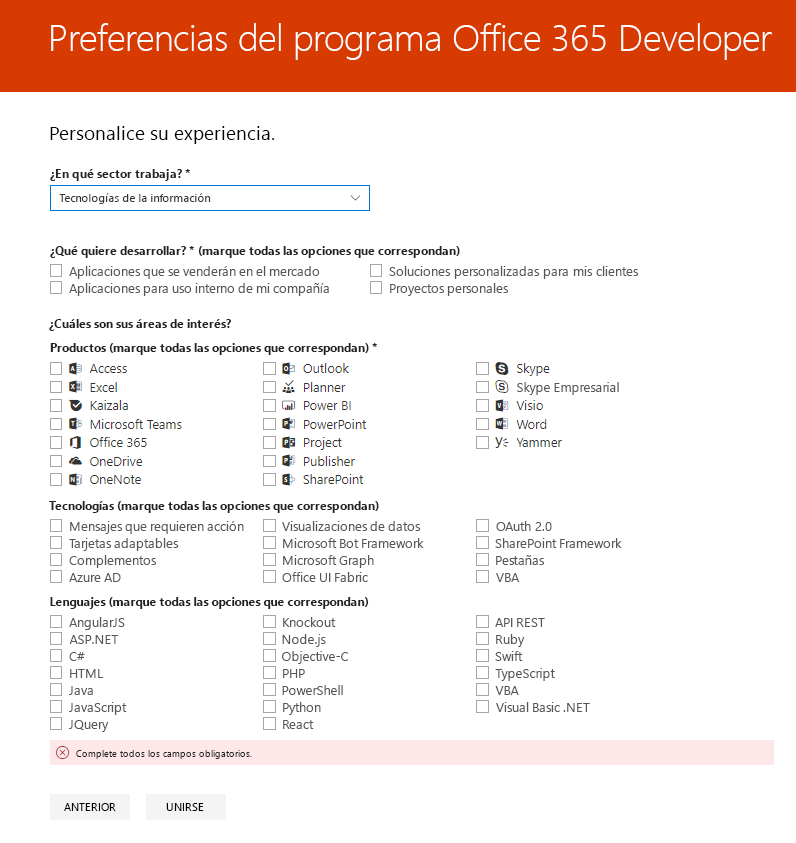

# Le damos la bienvenida al programa de desarrolladores de Office 365Welcome to the Office 365 Developer Program

Únase a sus amigos y compañeros en el programa de desarrolladores de Office 365.Join your friends and colleagues in the Office 365 Developer Program. Use la suscripción de desarrolladores de Office 365 para desarrollar las soluciones independientes de su entorno de producción.Use the Office 365 developer subscription to develop your solutions independent of your production environment. Puede crear soluciones para Microsoft Teams, complementos de Office, Microsoft Graph, SharePoint Framework, complementos de SharePoint y mucho más.You can build solutions for Microsoft Teams, Office Add-ins, Microsoft Graph, SharePoint Framework, SharePoint Add-ins, and more.

## Unirse al programa de desarrolladores de Office 365.Join the Office 365 Developer Program

1. Vaya a la página [Unirse al programa de desarrolladores de Office 365](https://developer.microsoft.com/office/dev-program).Go to the [Join the Office 365 Developer Program](https://developer.microsoft.com/office/dev-program) page. 

2. En la esquina superior derecha, elija **Iniciar sesión** para iniciar sesión con su cuenta de Microsoft o el correo electrónico habilitado para Azure Active Directory.In the upper-right corner, choose **Sign in** to sign in with your Microsoft account or Azure Active Directory-enabled email.

    > [!NOTE]
    > Recuerde la cuenta con la que inicia sesión.Remember the account that you sign in with. Inicie sesión en el panel [del programa para desarrolladores ](https://developer.microsoft.com/office/profile)con esta cuenta.You’ll sign in to the [Developer Program dashboard](https://developer.microsoft.com/office/profile) with this account. Esta cuenta es diferente al identificador de administración que usará para la suscripción a Microsoft 365 Developer.This account is different than the admin ID that you'll use for your Microsoft 35 developer subscription.

  

3. Después de iniciar sesión, elija **Unirse ahora**.After signing in, choose **Join now**.

4. En la página **Registro en el programa de desarrolladores de Office 365**, complete los siguientes campos en el formulario en línea:On the **Office 365 Developer Program Signup** page, complete the following fields in the online form:

  - **Correo electrónico de contacto****Contact Email**
  - **País o región****Country/Region**
  - **Empresa****Company**

  

5. Revise los **términos y condiciones**.Review the **terms and conditions**. Debe seleccionar la casilla de verificación para unirse.You'll need to select the check box before you can join.

6. También puede seleccionar la casilla **Me gustaría informarme sobre el programa de desarrolladores de Office 365** si quiere informarse sobre las nuevas funcionalidades y otras actualizaciones de Microsoft.Optionally, select the **I would like to hear from the Office 365 Developer Program** check box if you want to hear from Microsoft about new capabilities and other updates. 

7. Elija **Siguiente**.Choose **Next**.

8. En la página **Preferencias del programa de desarrolladores de Office 365**, díganos sus preferencias para poder personalizar su experiencia, incluyendo:On the **Office 365 Developer Program Preferences** page, tell us your preferences so we can personalize your experience, including:

  - El sector en el que trabaja.The industry that you work in.
  - El tipo de aplicaciones o soluciones que está interesado en desarrollar.The type of applications or solutions that you're interested in developing.
  - Los productos, tecnologías y lenguajes de programación que le interesan.Products, technologies, and programming languages that you're interested in.

  

9. Cuando haya terminado, haga clic en **Unirse**.When you're finished, choose **Join**. Las preferencias aparecerán en la página siguiente en la parte superior derecha y recibirá un mensaje de bienvenida.Your preferences appear on the next page in the top right, and you receive a Welcome message.

  

## Pasos siguientesNext steps

- [Configurar una suscripción del programa de desarrolladores de Office 365](office-365-developer-program-get-started.md).[Set up an Office 365 developer subscription](office-365-developer-program-get-started.md). 

- Cuando disponga de la suscripción de desarrolladores, [use su suscripción](build-office-365-solutions.md) para crear los tipos de soluciones que quiera.After you have your developer subscription, [use your subscription](build-office-365-solutions.md) to build the types of solutions that you want.

- Para obtener información sobre suscripciones que van a expirar, consulte [Caducidad y renovación de suscripciones](subscription-expiration-and-renewal.md).For information about expiring subscriptions, see [Subscription expiration and renewal](subscription-expiration-and-renewal.md).

- Para ver las preguntas más frecuentes sobre el programa de desarrolladores de Office 365, vea las [Preguntas más frecuentes](office-365-developer-program-faq.md).For frequently asked questions about the Office 365 Developer Program, see the [FAQ](office-365-developer-program-faq.md).

