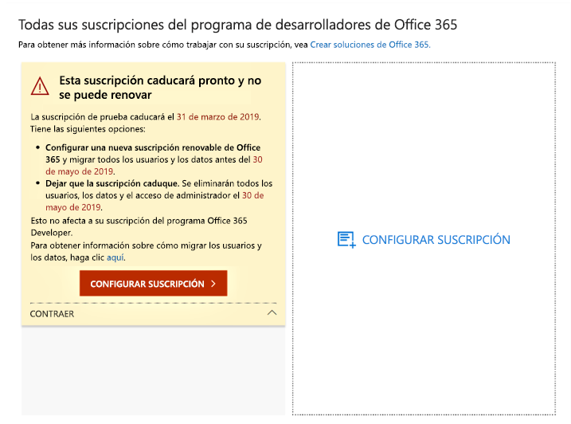
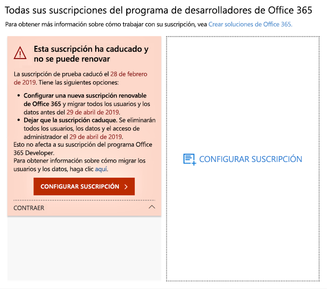
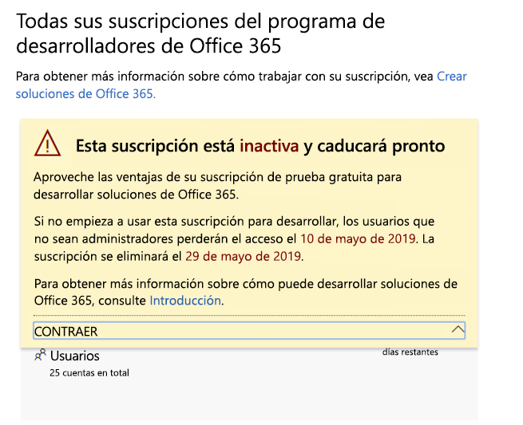
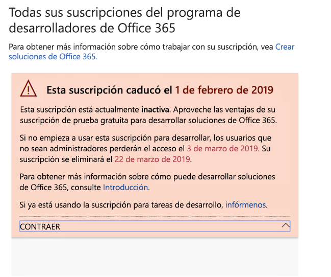
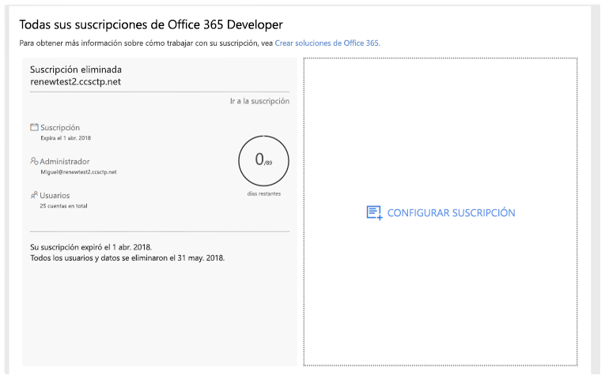

# Renovación y caducidad de la suscripción del programa de desarrolladores de Office 365Office 365 Developer Program subscription expiration and renewal

Su suscripción del programa de desarrolladores de Office 365 incluye una suscripción gratuita de desarrollador de Office 365.Your Office 365 Developer Program membership includes a free Office 365 developer subscription. Su suscripción de desarrollador puede renovarse en función de la actividad de desarrollo; sin embargo, algunas suscripciones antiguas sí caducan.Your developer subscription is renewable based on your development activity; however, some older subscriptions do expire. Este artículo describe la diferencia entre las suscripciones renovables y las no renovables y cómo actualizar la suscripción en caso de que expire.This article describes the difference between renewable and non-renewable subscriptions and how to update your subscription if it expires.

## Suscripciones de desarrollador renovables y no renovablesExpiring vs. renewable developer subscriptions

Con el lanzamiento del programa de desarrolladores de Office 365, se ofrecieron suscripciones de desarrolladores de 12 meses que caducan y no se pueden renovar.With the launch of the Office 365 Developer Program, we offered 12-month developer subscriptions that expire and cannot be renewed. En agosto de 2018, comenzamos a proporcionar suscripciones renovables a algunos miembros del programa de desarrolladores.In August 2018, we started providing renewable subscriptions to some developer program members.

A partir de abril de 2019, ofrecemos suscripciones renovables de 90 días.Starting in April 2019, we offer renewable 90-day subscriptions.

Puede determinar si tiene una suscripción renovable o no renovable mirando el [Panel del programa de desarrolladores de Office 365](https://developer.microsoft.com/es-ES/office/profile).You can determine whether you have a renewable or non-renewable subscription by viewing your [Office 365 Developer Program dashboard](https://developer.microsoft.com/es-ES/office/profile).

## Suscripciones no renovablesNon-renewable subscriptions

Si se registró para la suscripción antes de agosto de 2018, no es posible renovar la suscripción y verá la siguiente advertencia en el panel.If you signed up for your subscription before August 2018, your subscription is not renewable, and you'll see the following warning on your dashboard. Deberá reemplazar la suscripción antes de que caduque la actual.You'll need to replace your subscription before your current one expires. El texto de advertencia indicará que no se puede renovar la suscripción.The warning text will indicate that the subscription cannot be renewed. También le enviaremos un correo electrónico para recordarle que la suscripción va a expirar.We'll also email you to remind you that your subscription is expiring.
 
 

Cuando su suscripción expire, verá el siguiente texto de advertencia.When your subscription expires, you'll see the following warning text.

 

Para crear una suscripción de reemplazo, elija **Configurar la suscripción**.To create a replacement subscription, choose **Set Up Subscription**. 

También necesitará migrar los datos importantes que quiera guardar en la nueva suscripción.You'll also need to migrate any important data that you need to save to your new subscription. Para obtener más información, vea [¿Cómo puedo migrar mis datos?](#migrate-data) más adelante en este tema.For details, see [How do I migrate my data?](#migrate-data) later in this topic.

## Suscripciones renovablesRenewable subscriptions

Si se registró para la suscripción después de agosto de 2018, es posible que tenga una suscripción renovable.If you signed up for your subscription before August 2018, you might have a renewable subscription. Si la suscripción está inactiva, verá la siguiente advertencia en el panel.If your subscription is inactive, you'll see the following warning on your dashbaord. 

 

Cuando su suscripción expire, verá el siguiente texto de advertencia.When your subscription expires, you'll see the following warning text.

 

Si es un desarrollador activo, la suscripción se renovará automáticamente por otros 90 días a partir de la fecha de expiración original.If you're an active developer, your subscription will be renewed automatically for another 90 days. 

## ¿Por qué no es renovable la suscripción actual?Why isn't my current subscription renewable?

Introdujimos las suscripciones renovables en agosto de 2018.We introduced renewable subscriptions in August 2018. Si se registró para la suscripción antes de ese momento, la suscripción no es renovable y deberá configurar una nueva cuando expire.If you signed up for your subscription before then, your subscription is not renewable and you'll need to set up a new one when it expires.

## ¿Cómo migro los datos cuando expire la suscripción?How do I migrate my data when my subscription expires?

Para migrar los datos de la suscripción actual a una nueva suscripción, consulte los siguientes recursos:To migrate your data from your current subscription to a new subscription, see the following resources:

- [Cómo migrar los buzones de correo de un espacio empresarial de Office 365 a otroHow to migrate mailboxes from one Office 365 tenant to another](https://docs.microsoft.com/exchange/mailbox-migration/migrate-mailboxes-across-tenants)
- [Usar PowerShell para realizar una migración preconfigurada a Office 365Use PowerShell to perform a staged migration to Office 365](https://docs.microsoft.com/office365/enterprise/powershell/use-powershell-to-perform-a-staged-migration-to-office-365)
- [Migración de una suscripción de Office 365 a otra sin necesidad de tercerosMigration from one Office 365 subscription to another without third party](https://social.technet.microsoft.com/Forums/en-US/ee507441-eb91-4b0a-ba6c-5bd9bb8c71b1/migration-from-one-o365-tenant-to-another-o365-without-third-party?forum=onlineservicesmigrationandcoexistence)

## ¿Cómo sé si mi suscripción se ha eliminado?How do I know if my subscription was deleted?

Cuando se elimine la suscripción, verá una notificación en el panel indicando que la suscripción y su Id. se han eliminado, como se muestra en la siguiente captura de pantalla.When your subscription is deleted, you will see a notification on your dashboard that the subscription and its ID were deleted, as shown in the following screenshot. 

 

## Vea tambiénSee also

- [Unirse al programa de desarrolladores de Office 365Join the Office 365 Developer Program](office-365-developer-program.md)
- [Configurar una suscripción del programa de desarrolladores de Office 365Set up an Office 365 developer subscription](office-365-developer-program-get-started.md)
- [Usar la suscripción para crear soluciones de Office 365Use your subscription to build Office 365 solutions](build-office-365-solutions.md)
- [Preguntas frecuentes del programa de desarrolladores de Office 365Office 365 Developer Program FAQ](office-365-developer-program-faq.md)

